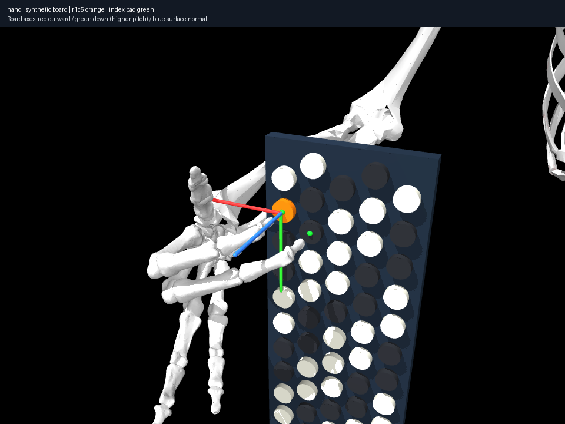

# Research log

## 2026-10-11 — Deliver the first substantial right-hand target library (040)

[040](experiments/040-exercise-library/notes.md) expands the unchanged fixed
reference into [31 targets](targets/CATALOG.md): nine baseline endpoints, six
simultaneous dyads, seven relocations, three held-index tasks, four sequences
and two equivalent-pitch comparisons. There are 33 physical realizations: 18
with contact candidates,13 with sampled movements and two unsearched hypotheses.
Fourteen recorded movement strategies retain both nearby branch choices and
three exact-composed sequences; no solver history is treated as a trajectory.
Targets stay musical identities; physical buttons/fingers and state branches
remain separately represented. No unsupported finger is silently substituted.

The new contact panel records 96 starts/12 reference solves and 50 distinct
candidates. Five released-contact paths, reverse E4→C#4 held middle motion and
wider C#4→G4 held middle motion are found. Direct held interpolation rejects;
22/32 waypoint solves find continuations. Return and five-event alternating
sequences join actual segments at exactly identical qpos/contact endpoints,
including reverse sampled kinematics without tempo or dynamic claims.

Every canonical endpoint has independent hand and instrument reports; every
sample of all seven new movements is independently audited. Endpoint minimum
case/rim/panel/cap clearances are 0.244/4.010mm/9.953µm. Configured constraints
pass, but cross-digit phalangeal overlap reaches 13.513mm at endpoints and 12.636mm
inside the wider held path. These remain unexplained proxy concerns, not measured
tissue penetration; all anatomical validation is unresolved and human feasibility
is null. The library's independent quality has that precise provisional scope.
No proxies/masks, wearing placement or instrument profiles were altered.

The manifest/query interface retains actual source commitments, search settings,
failures, budget prefixes, joint/held/clearance descriptors and selected renders.
`reproduce_argv` reruns each evidence workflow with its archived source. The
[library guide](targets/README.md) explains boundaries and descriptor definitions.
Selection uses family/direction/coordination diversity and control counterexamples,
not extreme distance or a universal ergonomic score. Two hypotheses remain
explicitly missing results. Unresolved skin/inactive-digit validation is the next
bottleneck, not a reason to suppress provisional target delivery.

An interrupted render-heavy prefix is retained honestly, separate from the full
bounded no-render recovery. Selected four diagnostic views, suspicious held
states and saved-state replay were inspected; four reviewed 040 images reproduce
byte-for-byte. Fourteen 040 frozen roots and 26 library roots/161 evidence files
verify complete integrity, which is not scientific validity. Final `uv run aec check` passes all 120 tests, Ruff formatting/lint and ty after
stable catalog regeneration. A prior run passed 119 tests but loaded the earlier
catalog module before the final audit join/regeneration; its consistency assertion
failed against new manifest bytes. Fresh focused checks and the complete final
canonical rerun pass. Initial overlapping render/test workloads were also
interrupted; none of these execution failures is a scientific reachability claim.

## 2026-10-11 — Reuse recorded branches and expose bounded search sensitivity (039)

[039](experiments/039-search-reliability/notes.md) keeps the exact fixed world and
compares two explicit eight-start/220-iteration panels on five contact targets.
Warm states reuse hashed 037 C4 branches; their earlier discovery cost is disclosed,
so this is amortized reuse rather than equal-total-cost algorithm superiority.
Distinct counts change 3/4/4/4/4→3/6/5/5/6; accepted attempts change 5→6/8 each.
Two initial-collision failures remain. Ordered 1/4/8-start summaries expose budget
and start-order sensitivity, while duplicates and invalid starts remain distinct.

Switching nearby D4 endpoint branches under identical planning budgets finds a
34.684 mm palm path versus the earlier 63.669 mm realization. Neither is a proven
necessary movement or human minimum. All 187 alternate-path samples and 25 warm
endpoints pass configured hand/instrument checks, but omitted phalangeal proxy
depth reaches 8.758/10.316 mm respectively. Anatomy stays unresolved.

Catalog release 0.3 re-evaluates the early realized targets with recorded warm
branches and retains both nearby trajectories, failed starts and prefix summaries.
Current exact source-hash joins attach independent audits to every evaluated
branch; ten frozen roots/85 evidence files verify. Five search and five catalog
tests pass, plus static checks. Selected four-view diagnostics and saved-state
replay remain curated. The final no-render repeat reproduces all 80 attempt
statuses/qpos and candidate arrays exactly; original redundant renders stay in
scratch. A reusable exact sampled-segment composer supports the forthcoming
sequence catalog without pretending that arbitrary endpoints form a trajectory.

## 2026-10-11 — Audit every saved hand/instrument sample without changing anatomy (038)

[038](experiments/038-hand-collision-audit/notes.md) introduces the versioned
`native-hand-proxy-report-v1` reporting policy. Classify five same-segment distal
capsule/ellipsoid composites separately from articulating same-digit geometry,
palm composition, configured separation hypotheses and unresolved cross-digit
phalanges. All 276 pairs among 24 hand proxies are queried independently of
engine masks and explicit pairs. No geometry is shrunk or repositioned.

Audit native neutral, 20 contact endpoints, 261 nearby, 578 larger and 400 held
path samples: 1,260 states and 8,255,520 instrument/proxy distances. Every configured
index/middle hypothesis and instrument constraint passes at saved samples.
Unresolved cross-digit phalangeal proxy overlap reaches 1.470 mm at neutral,
8.652 mm at central and 7.418 mm inside the held path, versus 2.973/1.651 mm at
its endpoints. Omitted middle/ring pairs remain concerns, not measured tissue
intersections. A complete anatomical collision policy is not justified.

Release 0.2 keeps all ten targets, attaches exact source-hash matched independent
reports, coverage counts, clearances and diagnostic render links. Eight realized
entries pass the specified provisional checks; hypotheses stay hypotheses and
all human feasibility remains null. The independently audited quality label
states its limited scope explicitly and does not certify anatomical nonpenetration.
All four views plus overlays for five selected states were inspected; 25 images
reproduce byte-for-byte. Six library frozen roots and the 038 record verify fully;
eight focused catalog/audit tests pass. Concurrent full-suite/render workloads
exhausted memory: redundant checks were stopped and the 040 contact batch resumes
with bounded no-render execution. A single full check follows the workloads.

## 2026-10-11 — Ship the early provisional exercise catalog (038a)

[038a](experiments/038-provisional-targets/notes.md) publishes ten musical targets
from exact 037 evidence before further anatomical research. Separate targets,
finite index/middle contact realizations and saved-state branches; retain C4
alternative-button and return-sequence hypotheses. A machine-readable manifest,
derived Markdown and `aec targets list/show/verify/build` make evidence searchable.
World component hashes and explicit index versus index/middle compiled variants
guard against silent state transfer. Actual candidate/discovery/path files link
with SHA256 and frozen roots; failed starts stay in discovery evidence.

All entries have null human feasibility and unresolved anatomical validity.
Existing endpoint coverage is not a sampled-path anatomical certificate. Integrity
verification checks 24 evidence files across five complete frozen roots; focused
catalog tests and local static checks validate the interface. Collision and
matched-budget search studies continue under the fixed reference, with no geometry
or instrument motion changes.

## 2026-10-09 — Remove automatic CI and make historical identity testing portable

The first 036 commit's hosted run failed at the historical compiled-model byte
hash assertion (99 other tests passed); the following 037 commit's hosted run
passed. Cross-machine CPU/libm/BLAS differences can alter compiled bytes without
establishing a source regression. The identity test now compiles 034's archived
source in an isolated interpreter on the same machine and compares exact current
model/profile identities against that reference. Production saved-state replay
hash guards remain unchanged and strict.

At the owner's request, remove `.github/workflows/check.yml`: automatic push/PR
full-suite and legacy EGL experiment runs stop. Local `uv run aec check`, targeted
checks and frozen record verification remain available for meaningful research
milestones. Historical Actions results and frozen experiments remain preserved. Three focused
fit/identity tests, Ruff and ty pass; no hosted run was triggered for this change.

## 2026-10-09 — Regress the independently mounted compact reference without anatomy claims

[037](experiments/037-upper-anchor-regression/notes.md) follows the 036 fit choice.
Raise the same compact case/board 41.507603 mm; keep all horizontal targets,
button normals, fixed seated anatomy and right mechanics unchanged. Fresh C4,
nearby D4, G6 relocation and both simultaneous gestures produce candidates.
Eight matched starts each preserve two initial-collision failures and one invalid
initialization; distinct counts are 3/4/4/4/4. Palm candidate diameters reach
115.846 mm. Selected C4 shoulder elevation changes 56.069→23.931 degrees while
wrist flexion increases 17.405→43.955; this is branch evidence, not comfort.

Nearby withdrawal/RRT/approach and larger direct sampled paths measure
63.669/162.518 mm. A held-index continuation is found after direct interpolation
fails: 22 waypoint solves, maximum held residual 81.478 µm and palm path
71.282 mm. Changed branches prevent global minimum-movement or general placement
advantage claims; 035's held failure remains published numerical evidence.

Independent all-solid audits of 20 contact endpoints and the held result keep
11–20 unchecked cross-digit overlaps, maximum depth 10.318 mm. Minimum endpoint
case/rim/panel clearance is 2.437/4.023 mm; cap clearance 23.403 µm. Intermediate
finger coverage is not certified. No anatomy was shrunk or masks weakened.
Four saved-state diagnostics and collision overlays were inspected for selected
contacts, ordinary-path middle states and held result. Reviewed central caption
uses v3, same compiled world/qpos; four replay images are byte-identical.

Eight regression and seven geometry frozen roots verify completely. The suite
passes 100 tests, Ruff and ty; final focused frame/render/identity checks pass.
The selected compact upper anchor is a reproducible fixed reference, above the
lap with strap equilibrium unproved. The updated roadmap keeps envelope/observed
pose and wearing-anchor uncertainty ahead of expanded exercise discovery.

## 2026-10-09 — Isolate case size from wearing height; retain compact upper anchor

[036](experiments/036-instrument-size-fit/notes.md) confirms the hidden mounting
assumption: v2 places actual lowest component points 10 mm above the highest
hip/knee station plus a synthetic 75 mm thigh radius. It has no independent
vertical shoulder anchor. This creates near-thigh geometry by construction,
not evidence of worn support. Manufacturer axes were checked separately:
FR-3xb is 390 mm tall, not its 430 mm piano counterpart. Pigini five-row size
pairs support a 420–430 mm taller hypothesis with explicit axis uncertainty.
Hermosa's inner-right-thigh brace/bellows-off-left-leg differs from lap-support
instruction; Petosa warns short cases increase strap burden, without load data.

Add `generic_cba_v3` with separately recorded case height and explicit upper-case
height relative to the neutral torso-attached shoulder. Preserve v2 serialization
and compiled identity exactly. The 380/430 mm size comparison fixes the upper
region, all button targets, widths/depth, anatomy and posture. Signed right/left
thigh clearances change 53.342/52.778→3.348/2.784 mm. Separate compact placement
trials at −80/−40/0 mm upper offsets give about 13/53/93 mm clearance. The low
430 mm case intersects thighs by about 37 mm and passive pelvis/femur proxies;
keep that rejected configuration. Query all native proxies including disabled
passive ones, bone convex representations and approximate support capsules
separately. Neutral anatomy's inherited humerus/thorax overlap remains.

Decision C: retain compact 380×360×200 mm geometry and choose the −40 mm upper
hypothesis for new fixed-body research. It remains above the lap; physical strap
support, calibrated skin and comfort remain unproved. No hand solve selected
this placement. All five comparison views inspected; twelve chosen images
reproduce byte-for-byte. Seven frozen roots verify complete integrity. New
independence/root-invariance/historical-identity tests bring the suite to 100;
Ruff and ty pass. Right-hand regression proceeds separately in 037, without
instrument motion, expanded full-body dynamics or a new reachability atlas.

## 2026-10-09 — Freeze the v2 right-hand comparison and audit every instrument solid

[035](experiments/035-cba-v2-regression/notes.md) compares validated 20-degree
`generic_cba_v2` against fresh rectangular/full-body controls retained in 033.
Eight matched perturbations per target preserve initialization failures and
alternative solutions. Central, nearby, larger relocation and both simultaneous
two-finger targets produce candidates; ordinary transitions find sampled paths.
The held-index transition fails a waypoint solve in both worlds. These finite
searches do not establish minimum movement or impossibility.

The revised mounting shifts C4 by (-14.392,-156.631,-40.000) mm while preserving
the canonical world button normal. Selected shoulder/elbow coordinates change
from 13.22/101.36 to 56.07/126.18 degrees. Geometry and wearing placement change
together, so this comparison does not isolate their effects. Nearby discovered
palm paths are 50.24/35.85 mm coarse/v2; larger paths are 116.40/163.74 mm.
Found wrist/arm configurations remain sensitive to initialization.

Independent collision coverage now queries every instrument solid, including
all caps and panels, against unchanged anatomical proxies. No collision masks,
solver constraints or anatomy were weakened. Across 17 v2 endpoints the closest
panel clearance is 3.581 mm and case/rim clearance 1.527 mm; active-cap penetration
reaches 13.19 micrometres within frozen tolerances. Unchecked cross-digit overlaps
remain 17..31, with maximum rigid-proxy depth 12.808 mm. Thus these contact/path
results are not complete anatomical feasibility claims.

All eight frozen roots verify with complete integrity. Four saved-state views
and collision overlays were inspected for representative contacts, ordinary
paths and the failed held state; corrected central images reproduce byte-for-byte.
97 tests, Ruff and ty pass. Historical worlds and rejected angle/attachment
experiments remain unchanged and guarded by their compiled identities.

## 2026-10-09 — Replace the challenged treble slope using direct construction sections

[034](experiments/034-cba-mounted-orientation/notes.md) responds to the owner's
local keyboard/case-angle concern and request for evidence beyond product
pictures. A builder's cut drawing and historical bayan repair sections distinguish
shallow rearward and near-forward structures, including stepped alternatives.
Their limits are explicit: none publishes a universal modern five-row angle.
Select one construction-informed flat-board hypothesis at 20 degrees instead of
55, origin H=(78,100,-160) mm, and rebuild the cheek/return around its backing.
No photograph metrology or successful hand fit determines these constants.
`generic_cba_v2` is the current selector; retired v1 requires its frozen source,
and old rectangular models keep exact identities. A transient 30-degree trial
remained unvalidated and unpublished.

Also fix a mounting composition error: seated angles specify B, so derive H by
removing R_HB. The old mounted implementation added the local tilt again. New
reference button normals are 30 degrees toward the player's right from forward.
Full-body anatomy, active coordinates, couplings and collision masks remain.
Instrument diagnostic views are orthographic, including a true top view; metric
section separates case, 12 mm board and 4 mm cap tops. Unnamed imported collision
surfaces now retain separate diagnostic entries instead of overwriting one key.

Numerical target error <=1.20e-16 m, minimum cap/nonparent clearance 5.5 mm,
intentional seams <=6.01 mm. Neutral body-proxy/component minimum 10.842 mm,
approximate thigh clearances 11.840/11.275 mm. Neutral anatomical humerus/thorax
overlap remains; no tissue feasibility or load equilibrium is claimed. All 97
tests, Ruff and ty pass; saved geometry integrity and render replay are checked.
[033](experiments/033-physical-cba-regression/notes.md) preserves superseded v1
multistarts, paths and unsuccessful searches with complete frozen integrity;
those poses are not accepted in v2. New-world comparison proceeds separately in
035, with independent collision coverage and known unchecked overlaps.

## 2026-10-09 — Ground the generic closed CBA and correct its treble attachment

[032](experiments/032-generic-cba-geometry/notes.md) introduces `generic_cba_v1`,
with independent treble/fingerboard, bass/Stradella and closed-bellows frames.
Public multi-view Roland/Hohner references plus construction sources separate
structural observations from every assumed metric. The owner identified the
first front-corner plate/block attachment as wrong. End views and primary Hohner
construction descriptions justify a rear-adjacent case cheek instead. Preserve
that rejected draft and its numerical successes under frozen source; they are
not accepted in the corrected compiled world.

B origin H=(55,100,-165) mm and 55 degree mounting angle are explicit hypotheses;
the angled board/backing, front shoulder and rear return are now distinct from
the grille. Hollow case/bellows walls replace the global solid collision box.
62 historical C-system buttons coexist with 96 finite slanted bass buttons;
bass pitch mapping remains unassigned. Strap landmarks are structural stations,
not loads or hand fitting. MyoFullBody reduction and right-arm couplings remain.
Pure bass-transform tests preserve every RH target; moving bellows are rejected.

All treble target-frame errors are below 3.11e-17 m; minimum cap clearance to
nonparent instrument components is 5.5 mm. Enumerated structural seams overlap
up to 7.62 mm; no usable caps intersect cases. Retained approximate thigh proxies
have 11.389/10.000 mm clearance; neutral anatomical-proxy/case minimum is 14.641
mm. A transient wall-axis error exposed why compiled frame checks and images are
both required. Six instrument views, section and five body views were inspected;
12 saved-state images reproduce byte-for-byte under EGL/Mesa. 97 tests, Ruff and ty pass. Frozen geometry
and rejected roots verify completely. Historical profile and MJB guards remain
strict. This grounds a generic geometric reference, not measured tissue,
wearing equilibrium, bass playing or anatomical feasibility.

## 2026-10-08 — Retain the reduced default with an explicit future active-arm choice

The project owner retains the current reduction for now. Clarify the rationale
in [031](experiments/031-full-body-architecture/notes.md) and the
[architecture documentation](docs/research/full-body-architecture.md): native
is usable; the approximately 0.31 s representative C4 saving supports repeated
right-arm searches but does not compel a reduced default. Extra setup cost,
frame-adapter maintenance and lost runtime articulation/non-right dynamics
remain explicit trade-offs. No anatomical accuracy advantage is claimed.

Future left-hand research will likely activate the left arm/hand and prescribe
or bake the right arm, torso, pelvis and legs using the same upstream full-body
source. This is analogous to the current right-active reduction, and remains
unimplemented until that phase. Left-arm parity, contact markers, constraints,
collision policy and accepted-state identities will need independent validation.
Revisit the default for actual left-hand or coordinated two-hand workloads,
frequent posture changes or maintenance costs; native or another active subset
may then be preferable. Current default, model code, frozen results and
instrument scope remain unchanged by this documentation clarification.

## 2026-10-08 — Reduced native MyoFullBody becomes the new anatomical default

[031](experiments/031-full-body-architecture/notes.md) compiles the locked MyoSim
right arm, bilateral arms, standard legs, torso/arms and native full body. The
native builder uses the same right-arm fragment and an in-memory mirrored left
arm; torso/sacrum and leg pelvis share the native root rather than a custom
pelvis alignment. Its “123” is a joint count (nq=129/nv=128 with free root), not
123 independent coordinates. Original anatomical meshes and mixed upstream
model lineages remain distinct from seated assumptions and support envelopes.

Choose **Outcome B**, `myofullbody_reduced`, for new programmatic player profiles:
compile a generic prescribed torso/left-arm/leg posture, resolve source
couplings and bake passive parent-relative transforms. Keep all skeletal bodies,
both arms/hands, both legs/feet, and the original right-arm 38 coordinates,
63 actuators, 67 tendons and 11 couplings. Native prescribed comparator keeps
122 scalar coordinates and freezes 84 passive coordinates; no full-body motion,
muscle control or left-hand playing task is introduced. Existing instrument
box, button geometry, topology, placement derivation and support hypotheses
are unchanged. Historical inputs explicitly select their original backend;
legacy profile serialization and strict compiled-world guards remain intact.

18 controlled states preserve right joint fields, geometry/marker frames,
rotational/positional Jacobians, bone meshes, muscle parameters and tendon
lengths to floating-point precision (maximum tendon difference 2.72e-15 m).
Rotated-root, all-body/bone native-to-reduced FK, left mirror and coupled
finite-difference tests pass. Five repeated C4 solves succeed per architecture:
median current/native/reduced 0.314/0.634/0.323 s; full forward
0.173/0.666/0.183 ms. Whole setup rises 1.427→2.399 s for reduction; prepared
anatomy compilation 64.7→111.4 ms. Serialized models are 74.1/69.9/69.5 MiB,
but allocator/import/render memory is separately reported, with no memory or
speed claim inferred solely from coordinate counts. Raw samples and source
snapshots are preserved, including a synthetic local 2 mm task.

Numerical C4 acceptance is narrow: reduced residual 0.07646 mm, actual distal
proxy/button distance 0.07622 mm, zero registered penetration/joint violation
and intact couplings. Independent finger coverage finds six phalangeal overlaps
in each architecture (maxima 2.295/2.313/2.295 mm). Broader queries expose native
left-arm/torso and torso/pelvis envelope overlap up to **87 mm**, unregistered
even in the original native pair list. Keep this negative evidence; do not
shrink proxies or blanket-enable pairs. The named matched research policy
retains original right masks/four pairs plus 16 existing finger hypotheses;
passive non-right coverage and human soft tissue remain unvalidated. A complete
skeleton is not collision-valid anatomy or biomechanical/ergonomic proof.

Front, both sides, oblique and complete right-hand close-ups were inspected for
all three architectures, as were all four playing diagnostics and highlighted
finger audits. Fifteen body images and four selected playing images reproduce
byte-for-byte from saved states. Native slide initialization exposed the old
hinge-only sampler; stationary prescribed slides now pass while moving or
unprescribed slides explicitly reject. Lazy engine import preserves headless
EGL setup. 93 tests, Ruff and ty pass; two frozen roots verify completely.
No historical frozen results are rewritten. Case/bellows/strap mechanics and
bilateral accordion operation remain for a separate phase.

## 2026-10-08 — Seated leg variation, initialization counterexample and CI portability

[030](experiments/030-seated-leg-variation/notes.md) samples 80/100° hip flexion
and a 90 mm assumed thigh envelope around the MyoSim seated reference. The
conservative support plane shifts shell/board −6.2/+69.5/+15.0 mm respectively.
All sampled approximate thigh/shell distances are positive. First 80° C4 solve
exhausts its budget with 471 mm residual and overhead arm; the same physical
world succeeds at 0.0397 mm after re-solving from a recorded numeric 029 prior.
This is a solver-seed counterexample, not an anatomical reachability boundary.
All four views for every success/failure were inspected and preserved.

100° and larger-envelope contacts succeed from the original seed. Discovered
wrist flexion remains 23–30°, not uniformly more ordinary than historical 023.
All three variation poses retain unchecked phalangeal overlaps (2.37/3.02/1.56
mm maxima), independently audited. No tissue/contact-force validity is claimed.
Five new frozen roots verify completely; successful 80° saved-state replay
reproduces four images in the same EGL environment.

Initial milestone f39c289 passed 81 local tests but CI rejected an exact new
derived-profile comparison across hosts. Follow-up regression checks recorded
fields within 1e−12 and deterministic repeated compilation in the same runtime;
historical 023 exact commitments still pass. Production profile/model guards
remain strict and unchanged: cross-host roundoff can require re-solving rather
than accepting a different compiled world. This portability limit is explicit,
not a reason to discard hashes or weaken accepted-state validation.

## 2026-10-08 — MyoSim anatomy replaces the handmade seated-leg default

[029](experiments/029-myosim-seated-lower-body/notes.md) evaluates standard MyoSim
legs, the reduced leg assembly and the full-body alternative. We choose the
standard `myolegs` pelvis/bilateral bone subtree: seated upstream hip/knee FK and
all 14 knee/patella couplings are evaluated and baked into fixed compiled frames,
then lower-body muscles/joints/wraps are removed. Original MyoArm anatomy, 38
coordinates, 63 actuators and 11 couplings remain. MyoSim is now the preferred
source for anatomical structure; new `SeatedSetup()` profiles default to it.

The old right-thigh axis was too high, lateral and forward relative to the
imported pelvis/hip frame. Independent anatomical hip→knee anchors replace its
instrument-dependent forward landmark. Clearly approximate femur-centered
support capsules remain separate from bone anatomy. The corrected conservative
vertical plane lowers shell/board 97.3 mm at unchanged torso root and yaw. Front,
right-side, oblique and treble/hand renders now show the pelvis, bilateral legs,
knees and feet; all were inspected alongside historical 023 views.

Preserved negative evidence: the first brace-height support plane intersected
the approximate capsules by 2.00/3.47 mm despite engine/solver success. Archived
source replay matched its MJB before independent distance queries. Separating
brace and vertical support references yields 11.47/10.00 mm shell/capsule gaps.
No skeletal scaling or envelope shrinking was used. These are assumed envelope
clearances, not actual loaded soft-tissue support.

Central C4 error is 0.0765 mm, actual distal/button distance 0.0762 mm, with
zero registered penetration/joint violation and intact couplings. Smaller
shoulder elevation comes with increased wrist flexion (−1.7→28.9°); no uniform
ergonomic improvement claim. Eight-start exploration finds two central and
three two-finger candidates, retaining failed attempts and near-limit branches.
Independent coverage still finds unchecked phalangeal overlaps in all six
accepted records, up to 13.3 mm. Leg anatomy does not fix hand-envelope validity.

Source categories, pose/envelope ranges, asset provenance, fixed-frame adaptation
and limits are documented in [seated-lower-body.md](docs/research/seated-lower-body.md).
No private measurements, extra library, skin system or full-body dynamics were
needed. Historical 023 profile and compiled-model hashes remain exact; earlier
published experiments are unchanged. All four saved-state images reproduce
byte-for-byte in this EGL environment. 81 tests, Ruff and ty pass; four frozen
roots verify completely. Chair/ground support, tissue, straps and muscle effort
remain outside this milestone.

## 2026-10-08 — Setup-family comparison and two placement/search counterexamples

[024](experiments/024-seated-setup-family/notes.md) compares eight seated members
with a matched-policy synthetic control, recalibrating C4 in every world. All
find D4 and G6 sampled transitions. G6 best discovered palm relocation spans
109–214 mm across the family, versus 320 mm synthetic; it is not a lower bound
on required movement. Four setup views were inspected for every case, and selected
G6 endpoints independently replayed. The corrected gross setup has a plausible
side arm approach and compact upper-torso/thigh relationship.

**Counterexamples to physical overinterpretation:** [027](experiments/027-yaw-search-refinement/notes.md)
recovers four C5 poses and a sampled path in the initially missing −45° yaw case.
Expanded starts also reduce zero-yaw D4 from 213.06 to 19.16 mm, with a direct
sampled path, unchanged geometry/tolerances. Thus apparent yaw boundaries and
large nearby movements can be search/branch artifacts. Preserve the coarse
results and refinement settings separately.

[025](experiments/025-seated-pose-diversity/notes.md) compares reference/own-world
synthetic C4 initializations and retains a transferred-prior control. Both own-
anchor cases find four central poses; nearby counts are 3/5, not a true feasible-
set comparison. Wrist flexion spans −5.3–2.0° seated C4 versus 5.3–43.9° synthetic;
nearby D4 spans −2.5–20.3° versus 44.0–44.7°. Dual-contact branches can still reach
wrist limits. Contact formulation, assumed lattice, anatomy and solver bias
remain alternatives to placement error.

[026](experiments/026-seated-held-contact/notes.md) holds C4 while middle moves
C#4→E4. Reference and transferred-prior synthetic searches find held paths, but
palm paths are 65.82/44.72 mm: the new setup is not uniformly smaller. Direct
interpolation loses held contact in all three controls. Own-anchor synthetic
endpoint selection fails its waypoint solve and partial held-edge audit; another
initialization succeeds, so no physical impossibility claim. Both successful
paths reproduce with twice-finer sampling, preserving all failures and inputs.

[028](experiments/028-seated-collision-coverage/notes.md) independently audits
73 poses: **every one has an omitted phalangeal proxy overlap**, up to 13.62 mm.
The setup correction does not establish full anatomical nonpenetration. Neither
proxy sizes nor blanket self-pairs were changed. Real hand envelopes, shell shape,
button operation and strap/support forces remain unvalidated; personal photos
were not requested. Public evidence suffices for the generic setup hypothesis,
not precise tissue or population inference.

76 tests, Ruff and ty pass. Frozen numerical roots verify completely, including
an exported staged checkout. Saved-state renders accompany representative poses;
translated legacy comparison cameras now follow the torso and write source/model
manifests. Original published experiments 001–022 remain unchanged. The baseline
is now an explicit body-anchored setup family, with robust discovered outcomes
and sensitive numerical magnitudes distinguished from human ergonomic claims.

## 2026-10-08 — Public-evidence-guided body-anchored seated setup

[023](experiments/023-reference-seated-setup/notes.md) adds a generic compact CBA
setup with Roland's 365/195/380 mm catalogue scale, compiled thorax support
planes, shoulder-relative treble edge and pelvis-relative thigh-height reference.
[Public evidence and broad parameter ranges](docs/research/seated-setup.md)
separate pedagogy, visual examples and model assumptions. Sources disagree on
bellows/left-thigh contact and right-thigh engagement; no rigid pin or inferred
load fraction is introduced. No private calibration or copied public media.

Compared with 018, C4 is 180 mm higher and 90 mm inward relative to neutral
shoulder; forward offset changes only 10 mm. Instrument depth makes a large
surface-forward offset unsurprising. New four-view diagnostics expose the shell,
support references and side arm approach. The solved wrist flexion is straighter,
but deviation is larger; this first pose comparison changes digit/pair policy too.
Matched-policy comparisons and family search are underway.

C4 marker error is 0.03922 mm; actual button separation 0.03826 mm; all 11
couplings hold. Independent shell distances are ≥4.038 mm; fixed thorax shapes
are checked despite engine weld filtering. **Coverage falsification:** seven
unchecked middle/ring phalangeal overlaps reach 8.68 mm. A more plausible gross
setup is not a fully collision-valid human pose. The shell is a conservative
box, thighs schematic, straps/support forces and real hand envelopes uncalibrated.

Saved-state rendering reproduces all four views; both frozen records verify.
75 tests, Ruff and ty pass, including frame covariance, scale recalculation,
cached-transform rejection and unchanged legacy profile hashes. Old published
worlds remain intact. This is a validated setup implementation milestone;
family robustness and representative transition results remain to be established.

## 2026-10-08 — Automated integrity checks across research workflows

Manual checks repeatedly tripped over different pose, coverage, sweep and
held-output schemas. Added `uv run aec verify DIRECTORY --require-complete`:
it verifies source archives, recorded source/lock hashes, available profile
hashes, exact input bytes and referenced evidence without depending on today's
source tree. All seven record roots from 018–022 pass. Missing metadata reports
`partial`; mismatches fail. Tamper tests change archive, input, profiles and
lock commitments; older incomplete evidence stays explicitly incomplete.

The first verifier CI run exposed a publication mistake: Node's broad `coverage`
ignore pattern had omitted 019's anatomical audit directory. Local checks saw
files absent remotely. Restored the unchanged audit records and renders with a
scoped exception for published experiment coverage. Verification now also checks
the staged tree in a fresh exported checkout before pushing.

Seventy-one tests pass with Ruff and ty. Research commits through the held
continuation pass remote CI. Integrity is distinct from numerical reproduction
and human validity; the verifier does not authenticate records or certify every
result field or image. This phase established corrected collision numerics,
selective-pair pose diversity and a held transition with independent distance
checks. The next scientifically grounded expansion needs observed/calibrated
anatomical envelopes and body/instrument setup, using the existing measurement
protocol; selected-pair successes cannot establish full hand nonpenetration.

## 2026-10-08 — Held continuation under selective self-collision constraints

[021](experiments/021-dual-contact-seed-transfer/notes.md) transfers an accepted
C4+C#4 seed to the same eight-start search. C4+Bb3 still has no discovered pose;
C4+E4 has four. This preserves the negative result while testing a different
initialization, without claiming impossibility.

[022](experiments/022-held-contact-with-self-pairs/notes.md) keeps index C4 held
while middle moves C#4→E4 under all 16 selected phalangeal pairs. Direct joint
interpolation is collision-clear but loses the held contact by **4.31 mm**.
Withdrawal/translation/approach yields 42 configurations and 1,014 audit samples:
held error ≤0.07104 mm, detected penetration ≤0.02545 mm, independently queried
selected-pair separation ≥0.04043 mm. Palm path/excursion are 38.39/13.14 mm.
A twice-finer regression passes. Resulting contacts are independently revalidated.

Added effective solver settings to numerical results, recorded cameras and
selectable views for animation. A fault-injection test confirms pair-distance
auditing rejects a declared overlapping pair even if engine registration is
missing. Fifty-eight tests pass with Ruff and ty. The fixed dependency stack,
old records and unmodified envelopes remain intact. These developments improve
internal consistency; omitted anatomical clearance, human pose validation and
instrument/button calibration still require the measurement protocol before
human ergonomic conclusions are justified.

## 2026-10-08 — Step checks restore C4; selective self-pairs change pose discovery

[018](experiments/018-collision-step-backtracking/notes.md) samples proposed IK
edges and halves colliding steps. The cold-start C4 solve that failed in 017
succeeds in eight iterations, two halved steps, 0.04833 mm marker error and zero
detected penetration. No geometry or tolerance change. Colliding seeds fail
explicitly. This is numerical iteration safety, not proof of unsampled motion.

[019](experiments/019-selective-self-collision/notes.md) compares eight starts
with/without 16 index–middle phalangeal pairs on unmodified proxies. Distinct
C4 / C4+Bb3 / C4+C#4 counts are **3/3/2 versus 2/0/3**. Independent auditing finds
3.22–13.39 mm index/middle overlap in reference dual poses. Constrained C#4 poses
have zero or 0.00256 mm, within the unchanged 0.1 mm tolerance. Other digit/palm
envelopes remain unvalidated. More constraints can redirect local IK into new
branches; more candidates is not a larger true feasible set. Bb3 is not found,
not impossible.

[020](experiments/020-selective-transition-comparison/notes.md) repeats six index
queries from exactly the same C4 coordinates under both pair policies. Both
find six sampled transitions, but best discovered palm relocations differ by
up to 48.97 mm. Do not compare counts to 007's different source posture/solver.
Pair policies, guard parameters, model/profile hashes and frozen source are
recorded. Fifty-five tests pass with Ruff and ty. Next: transfer a constrained
dual-contact seed to investigate the missing Bb3 pose, then revisit held motion.

## 2026-10-08 — A collision-limit dependency defect, then a useful corrected-solver failure

Continuing beyond the calibration boundary exposed a numerical issue we can
investigate without new anatomy. [016](experiments/016-displacement-limit-probe/notes.md)
shows Mink 1.3.0 bounds joint displacement using a velocity-scaled gap. Synthetic
spheres with a 10 mm gap overlap by 20 mm at ordinary timesteps; world/top-level
pairs are also dropped. Upstream documents both fixes as unreleased; latest
stable PyPI remains 1.3.0. Kept the lock and added a tested project displacement
adapter. All dt cases retain the expected 1.5 mm gap; gradients are independently
checked on both sides of contact. Legacy published inputs retain their algorithm.

[017](experiments/017-corrected-contact/notes.md) fails to discover C4 from the
same initially clear pose: 200 iterations, 33.52 mm marker error and 11.20 mm
penetration. Correct local units do not prevent a large nonlinear step from
crossing the detection band. Preserved the failed state and four views; next
is sampled solver-step backtracking before selective active-digit constraints.
Fifty tests pass with Ruff and ty. Human envelope calibration remains necessary.

## 2026-10-08 — Held tasks and large-relocation selection expose a collision-coverage boundary

[012](experiments/012-large-relocation/notes.md) selects a model next action from
the physical atlas: C4→G6 with **300.29 mm discovered palm relocation**, 480.12 mm
sampled palm path. A finer 2,230-sample audit passes existing constraints.
This is a selected realization, not proof that the action requires that movement
or a validated human exercise. Explicit finger-bound states/actions/trajectories
and independently checked endpoint exports preserve the physical question.

[013](experiments/013-held-index-transition/notes.md) holds index C4 while middle
moves Bb3→C#4. Direct interpolation is collision-clear under current coverage
but loses index contact by **25.66 mm**. Incremental withdrawal/translation/
approach finds 43 configurations whose 855-sample audit retains contact within
0.08307 mm; a twice-finer regression also passes. The resulting gesture is a
new endpoint, independently revalidated. Force and continuous validity remain
unknown. [011](experiments/011-inactive-digit-policy/notes.md) allows unused
digit articulation: one additional endpoint in six queries, no additional path
within budget. Search failures remain distinct from impossibility.

**Important falsification:** [014](experiments/014-collision-coverage/notes.md)
finds all 36 imported anatomical proxies suppress automatic self-collision.
Four explicit pairs cover thorax/arm only. Independent cross-digit distances
find up to **14.00 mm unchecked phalangeal overlap** in an accepted dual contact;
even the single-contact reference has 1.47 mm. These numerical contact successes
do not establish full anatomical nonpenetration. Simply enabling all pairs
would also reject intentional palm-envelope composition and the reference.

**Replay repair:** [015](experiments/015-exercise-endpoint-replay/notes.md) finds
the derived exercise input still initialized from the atlas anchor, potentially
re-solving to another pose. New exports initialize from the selected endpoint,
carry their own identifier and preserve the source separately. Independent
replay agrees within 1e-12 rad. Original 012 records remain inspectable.

**Validation:** 38 tests pass with Ruff and ty; frozen executed source and current
dependency metadata accompany new records. Rendering restores model arrays.
The next scientifically grounded step is validating hand envelopes and observed
playing poses, then measured board/body setup and button operation. Expanded
[measurement protocol](docs/research/frames-and-measurements.md) specifies raw
observations, uncertainty, frames and calibration acceptance. Further human
ergonomic inference is not justified by adding more searches to this unvalidated
world; preserve the synthetic laboratory and rerun its studies after calibration.

## 2026-10-08 — Full-board atlas and parameter sensitivity, with a numerical falsification

[007](experiments/007-index-atlas/notes.md) explores all 62 buttons from C4 with
three index-contact starts each: **29 discovered sampled transitions, 33 missing
poses**. Unused digits are frozen, so these are restricted-model/search outcomes,
not human reachability. Best discovered endpoint palm relocations span 0–300 mm.
The 213 s run spends ~189 s discovering endpoints. Hash-checked per-action data
and executed source archives make the atlas inspectable and rerunnable.

[008](experiments/008-geometry-sensitivity/notes.md) repeats 12 queries under
±2 mm column spacing and ±15 mm board placement. Outcomes and discovered palm
movement change substantially. **Counterexample to a physical interpretation:**
a 21 mm-spacing C5 transition missing at 5 mm withdrawal steps is found at 1 mm
steps, without relaxing collision tolerance. At least one apparent geometric
boundary was planner resolution. Moving the board forward requires multi-start
source-contact recalibration; the single starting pose failed.

[010](experiments/010-hand-geometry-sensitivity/notes.md) adds a tested geometric
hand transform about the fixed wrist. ±5% scales complete hand geometry and
inertial dimensions, retaining source axes/ranges. Muscles and tendons are removed
in the explicit hypothesis mode; this is not physiological personalization.
Eight queries find 8/7/8 sampled transitions at factors 1/.95/1.05. Discovered
relocations change by up to 41.54 mm. Individual segment calibration remains open.

**Validation:** 32 tests pass; archived package hashes match recorded execution
hashes. New model parameters are materialized before strict patches. No difficulty
scalar or global impossibility claim was introduced. Next: select/render a
large-relocation realization, test held-contact behavior and probe the effect of
currently frozen unused fingers before interpreting atlas boundaries.

## 2026-10-08 — Action laboratory, frozen execution and first dual contacts

Added parameter-bound playing states, finite next-action discovery, physical
pose descriptors, board atlas rendering and strict profile sweeps. Long runs
now archive and execute immutable package source: concurrent edits previously
made source hashes disagree with cached modules. A fault-injection test confirms
isolation. Source inputs are read and hashed from the same bytes.
[Workflow contract](docs/research/action-laboratory.md).

[009](experiments/009-two-contacts/notes.md) establishes two simultaneous
index/middle rigid-proxy contacts, with 0.0216/0.0152 mm maximum marker errors.
The rendered palm is unusually reoriented: acceptance under these proxies
is not representative human playing. Kept the pose as evidence of incomplete
constraints. A new envelope invariant caught an aliased NumPy axis buffer;
prior dual-contact failures from the faulty marker are explicitly invalidated
and archived with their source. Single-index geometry is unaffected.

The full-board and sensitivity evidence is being curated from frozen reruns;
preliminary counts are finite-search findings, not physical impossibility.
Next: publish those records, refine tolerance-sensitive paths, demonstrate a
large relocation, and investigate hand-dimension perturbations carefully.

## 2026-10-08 — Diverse poses and a discovered path around the keyboard

[005](experiments/005-pose-diversity/notes.md) finds six D4 and seven C5 contact
configurations from eleven deterministic starts each. The earlier D4 wrist
margins (0.45°/0.73°) are not necessary: another pose has 5.19°/10.84° margins,
with 70.1 mm rather than 29.6 mm palm relocation. Pose diversity changes the
interpretation; no configuration is designated representative of humans.

[006](experiments/006-transition-search/notes.md) connects the previously
colliding C4→C5 endpoints using 20 mm incremental withdrawal and seeded
bidirectional joint-space search. Direct interpolation penetrates 13.49 mm;
the discovered path peaks at 0.03583 mm under the 0.1 mm tolerance. All 331
samples pass; a five-times-finer edge audit also passes. Palm path length is
223.1 mm. Unsampled intervals and human/dynamic feasibility remain unknown.
A restricted single-waypoint/no-RRT search failed and is preserved.

**Diagnostic repair:** new multi-state rendering exposed missing forward
kinematics and persistent overlay colours. Fixed both, regenerated new evidence,
and tested that poses change and rendering preserves the compiled-model hash.
Twenty-three tests now cover diverse contact and path-search regressions plus
headless rendering. Next: explore the board from a recorded state, then test
sensitivity to uncertain geometry and placement.

## 2026-10-08 — Recalculation profiles and model-verified replay

Separated instrument dimensions, board/torso placement, imported player ranges,
rigid-contact policy and solver settings in schema 2. Legacy inputs still work.
[Experiment 004](experiments/004-profile-recalculation/notes.md) reproduces the
legacy compiled model and contact result exactly. Board rotation, independent
torso translation and wrist-range changes are tested against compiled geometry.
New outputs embed resolved profiles and their hash plus the complete compiled
model hash; replay rejects silent model changes. Twenty tests pass.

**Boundary:** dimensional anatomy personalization is not yet supported. Uniform
scaling is not assumed physiologically valid. Imported geometry, unmeasured
setup, rigid collision envelopes and unknown button travel remain explicit.
[Calibration contract](docs/research/profiles.md). Next: candidate diversity and
searching paths around the known interpolation collision.

## 2026-10-08 — An invalid transition between accepted endpoints

**Question:** Can accepted contact endpoints be safely connected by linear
joint interpolation? **Negative result:** no for this supplied path.

[Experiment 003](experiments/003-transition-counterexample/notes.md) interpolates
C4/r1c5 to C5/r1c9 through 101 samples. Both endpoints pass; all sampled joint
ranges and shoulder couplings pass. Yet 95 samples exceed the collision
tolerance, peaking at **13.49 mm** penetration of the hand/metacarpal proxy
into the board at progress 0.33.

**Interpretation:** pose feasibility and path validity require separate checks.
This candidate is rejected (`candidate_valid=false`). Whether another path
exists remains unknown (`global_transition_feasible=null`). Sampling can expose
a violation but cannot certify unsampled intervals. The parameter is progress,
not time; no dynamics or button-operation claim is made.

**Debugging discovery:** MuJoCo's default display hides the imported group4
collision proxies. The fifth, proxy-only diagnostic view exposes what the
bone meshes cannot show; penetrating objects appear red. Four standard views
remain available, and the worst state can be rendered directly from the saved
record. All five views reproduced identically locally.

**Validation:** canonical checks now include 17 tests. The final implementation
passed [remote CI](https://github.com/arthow4n/accordion-ergonomics-core/actions/runs/37708173931),
including locked setup, Ruff, ty, all tests and EGL reproduction. The new
regression checks both valid endpoints, preserved ranges/couplings and the
intermediate collision.
`aec transition` records every sample, input/state hashes and rejection reason.
Updated the repository contact skill with the display-group failure mode.
A prose endpoint label was corrected from E5 to C5: r1c9 is MIDI 72. The
stored mapping, poses and numerical experiment were already correct.

**Next direction:** explicit withdrawal/approach trajectories, continuous or
adaptive collision checking, then multi-start pose comparisons and calibration.
The current stack supports the research slice; real instrument/player geometry
and physiologically plausible actuation remain unvalidated.

## 2026-10-08 — Movement ablation exposes a relocation/range-margin tradeoff

From the same accepted C4 pose, compare index-only movement with seven
independent arm/wrist coordinates frozen against arm-enabled solves.
[Experiment 002](experiments/002-arm-ablation/notes.md) preserves every generated
input, accepted/rejected endpoint and four diagnostic views per condition.

| Arm-enabled target | Board displacement | Palm relocation | Wrist flexion limit margin | Index abduction limit margin |
|---|---:|---:|---:|---:|
| Farther r1c9 | 76 mm | 61.6 mm | 38.63° | 9.32° |
| Nearer r3c5 | 38 mm | 29.6 mm | 0.73° | 0.55° |

The farther target costs more relocation and substantial shoulder/forearm
rotation, yet its chosen wrist/finger pose has larger range margins. The
closer target has a near-limit local candidate. Both finger-only searches
failed; that is not an impossibility certificate. The grid distance terms
alone rank these oppositely to their wrist margins, but no physical dimension
has been shown to define overall difficulty.

<table><tr><td></td><td></td></tr></table>

**Learned:** articulated state is needed to describe the actual relocation and
joint tradeoffs. **Still inconclusive:** whether the model outperforms simpler
reasoning for real ergonomic preference, whether these poses are comfortable,
or whether the near-target joint demands are unavoidable. One start and
assumed geometry cannot establish those claims. No transition path is validated.

**Validation:** 16 tests plus Ruff/ty; a regression verifies frozen arm angles
and palm translation/rotation really remain fixed. A second ablation reproduced
structured outputs and all 16 PNGs identically locally. CI's corrected action
pins passed remotely, including locked installation and headless EGL rendering
([run](https://github.com/arthow4n/accordion-ergonomics-core/actions/runs/37707470593)).
The demonstrated contact/frame workflow is now a narrow repository skill at
`.agents/skills/aec-contact-diagnostics/SKILL.md`, validated using skill-creator.

**Next:** test candidate transitions between these accepted endpoints, then
multiple starts to determine which near-limit results are solver bias.

## 2026-10-08 — CI setup failure diagnosed remotely

The first pushed workflow failed before checkout: GitHub could not resolve
`astral-sh/setup-uv@v10`. The latest release tag is v10.2.0 but no v10 major alias
exists. Remote job annotations exposed the cause even though unauthenticated
log download returned HTTP 403. Pin checkout v7.0.1 and setup-uv v10.2.0 to
verified tag commit hashes. Local canonical checks passed. The corrected workflow subsequently passed
remotely, including its EGL reproduction step (see newer entry).

## 2026-10-08 — First headless contact slice; surface errors caught by diagnostics

**Started by GPT-6.1 Sol, reasoning effort Medium, in Codex.**

**Question:** Can the current MuJoCo/MyoArm/Mink stack place an anatomical right
arm at one CBA button while preserving imported constraints and producing
reproducible headless evidence?

**Result:** Static contact candidate found on the explicitly synthetic metric
fixture: C4 at r1c5, index finger, about 0.059 mm marker error; 11 joint couplings
preserved to floating-point precision; no joint-limit violation; approximately
0.033 mm proxy penetration, below the recorded 0.1 mm numerical tolerance.
This establishes infrastructure and a bounded static result, not real playing
feasibility. Wrist deviation and index abduction are each within about 0.5° of
an imported range boundary. A successful solve is not an ergonomic endorsement.

**Failures that changed the implementation:**

- An early low-residual solution had no actual fingertip contact. The pad marker used an unresolved MjSpec quaternion while the capsule orientation was specified in Euler angles. Derive from *compiled* geometry instead.
- A volar capsule support touched with the middle phalanx penetrating about 1 mm. It also selected the proximal capsule pole, so it was inappropriate as a fingertip marker.
- A distal capsule pole still let the overlapping fingertip ellipsoid penetrate about 3 mm. Use the distal outer support envelope of both imported shapes and verify actual signed contact distances.
- Initial diagnostic cameras saw the keyboard from behind. Camera look-direction convention is now encoded; test board normal and compare its pitch staggering with the manual.

The misleading historical “success” is retained and explicitly invalidated in
[experiment notes](experiments/001-single-contact/notes.md); failed poses are
useful evidence. Numerical weights and tolerances are solver settings, not
physical constants or biomechanical comfort thresholds.

**Instrument audit:** Both prior repositories agree on finite bounds and pitch
anchor. Roland's p50 diagram supports that mapping but contradicts the app
embedding at equal logical columns: downward offsets are `[0,.5,1,.5,1]`,
not `[0,-.5,0,.5,0]`. Metric half-spacing remains a regular-lattice assumption.
No existing friction/crossing scalar is treated as established biomechanics.

**Tooling:** src-layout, mandatory uv/lockfile, Ruff, ty, pytest; canonical
`uv run aec check`, experiment and saved-state render commands. CPython 3.14.7
works with latest maintained stack distributions. Announced Python 3.14.8 has
no uv-managed download here yet. Ty cannot resolve MuJoCo's native wildcard
symbols; an explicit untyped engine boundary contains that limitation.
EGL software rendering works without DISPLAY despite device-permission messages.
No managed cloud status tool or network-policy file is available on this executor;
ordinary HTTPS checkout/package retrieval succeeded.

**Next:** Multiple starts and movement-budget ablations, then measured geometry,
body placement and collision-validated approach/release paths. The physical
trajectory and button press are still missing; `feasible` remains null.
