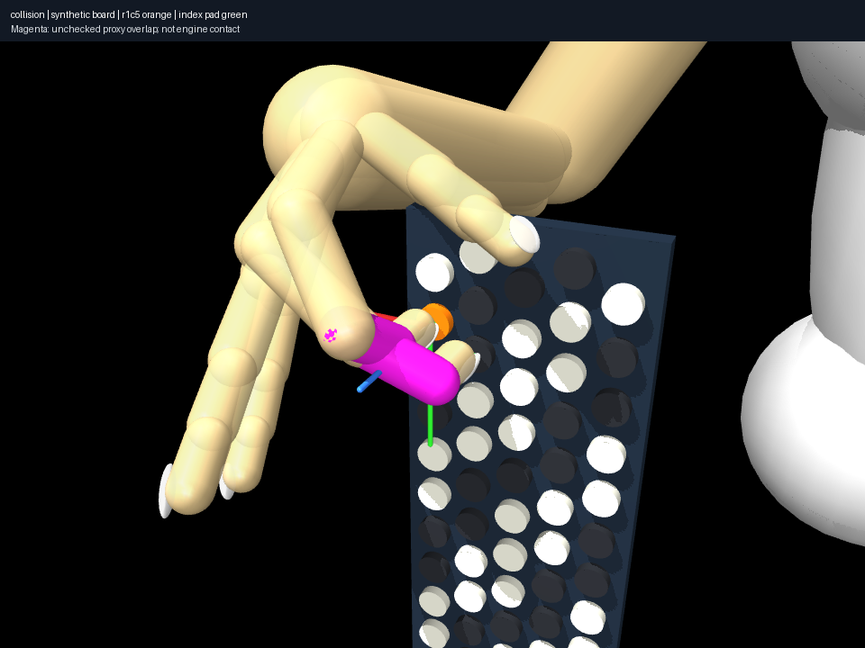
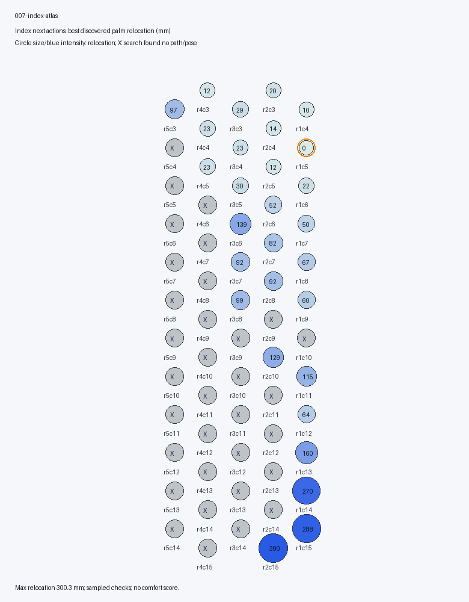
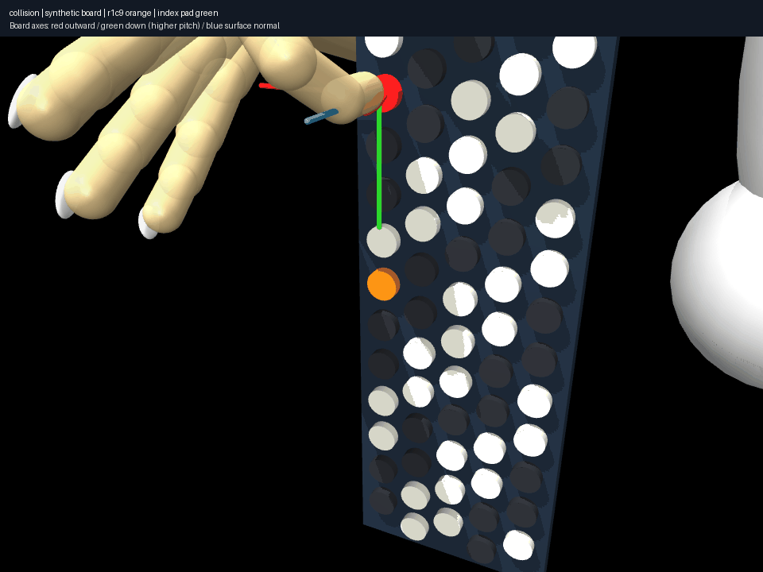
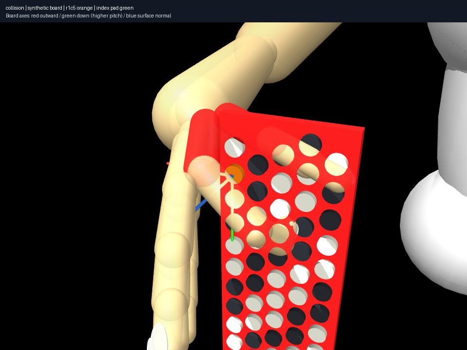
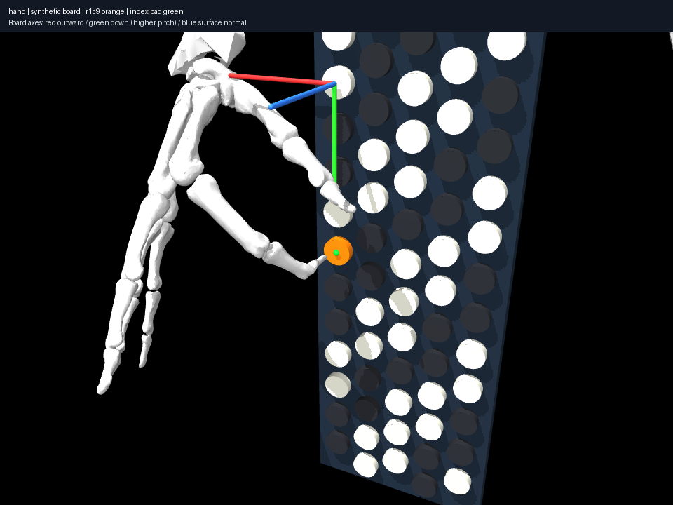
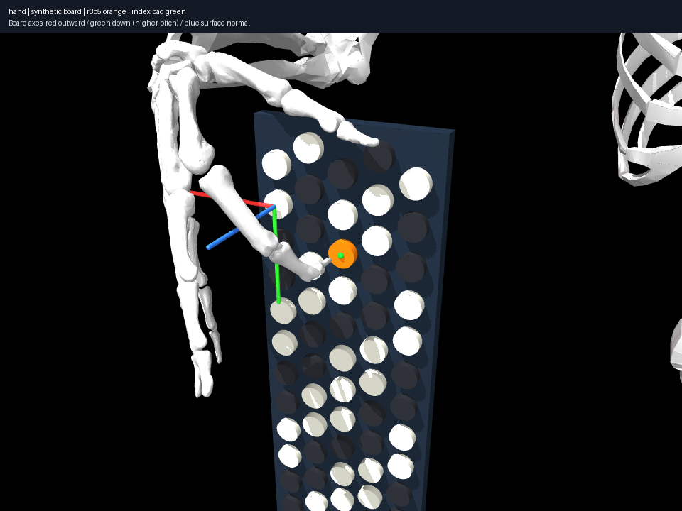
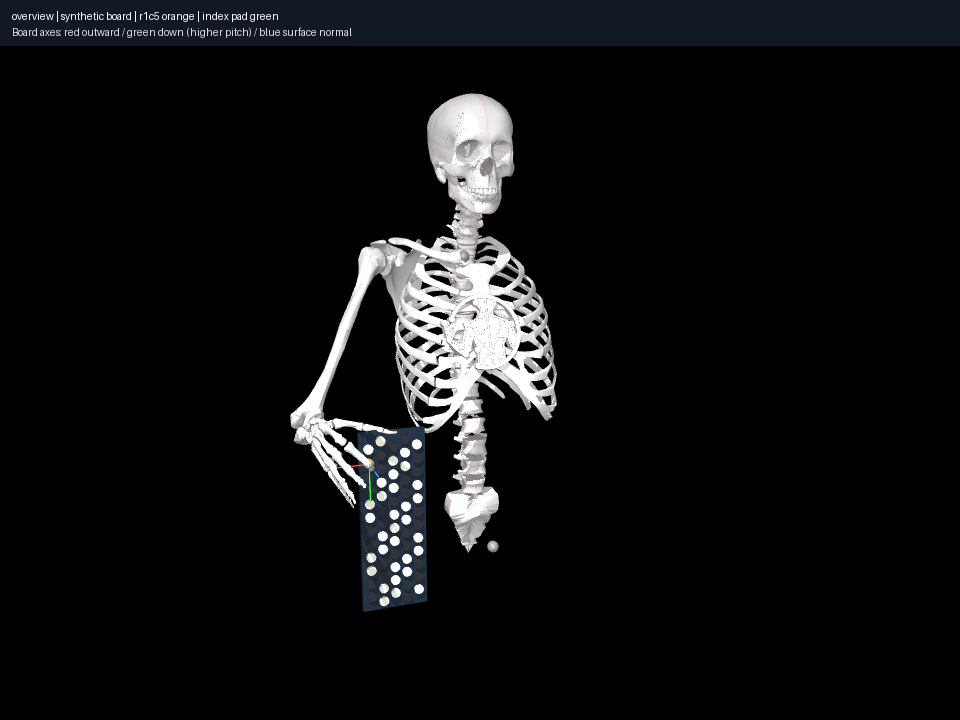
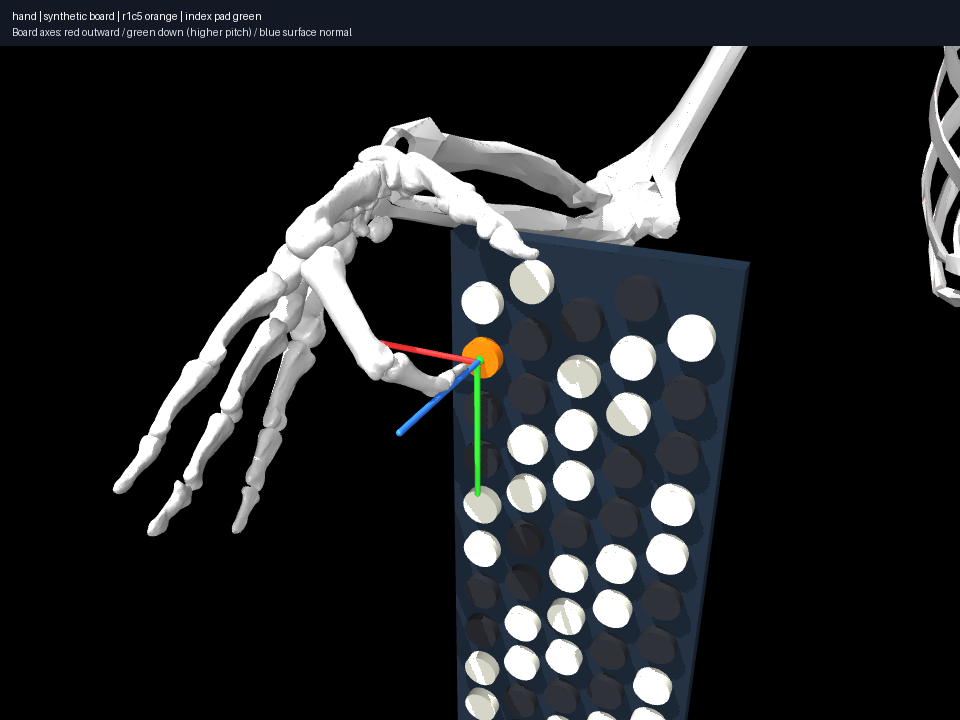

# Research log

## 2026-10-08 — Held tasks and large-relocation selection expose a collision-coverage boundary

[012](experiments/012-large-relocation/notes.md) selects a model next action from
the physical atlas: C4→G6 with **300.29 mm discovered palm relocation**, 480.12 mm
sampled palm path. A finer 2,230-sample audit passes existing constraints.
This is a selected realization, not proof that the action requires that movement
or a validated human exercise. Explicit finger-bound states/actions/trajectories
and independently checked endpoint exports preserve the physical question.

[013](experiments/013-held-index-transition/notes.md) holds index C4 while middle
moves Bb3→C#4. Direct interpolation is collision-clear under current coverage
but loses index contact by **25.66 mm**. Incremental withdrawal/translation/
approach finds 43 configurations whose 855-sample audit retains contact within
0.08307 mm; a twice-finer regression also passes. The resulting gesture is a
new endpoint, independently revalidated. Force and continuous validity remain
unknown. [011](experiments/011-inactive-digit-policy/notes.md) allows unused
digit articulation: one additional endpoint in six queries, no additional path
within budget. Search failures remain distinct from impossibility.

**Important falsification:** [014](experiments/014-collision-coverage/notes.md)
finds all 36 imported anatomical proxies suppress automatic self-collision.
Four explicit pairs cover thorax/arm only. Independent cross-digit distances
find up to **14.00 mm unchecked phalangeal overlap** in an accepted dual contact;
even the single-contact reference has 1.47 mm. These numerical contact successes
do not establish full anatomical nonpenetration. Simply enabling all pairs
would also reject intentional palm-envelope composition and the reference.

**Validation:** 37 tests pass with Ruff and ty; frozen executed source and current
dependency metadata accompany new records. Rendering restores model arrays.
The next scientifically grounded step is validating hand envelopes and observed
playing poses, then measured board/body setup and button operation. Expanded
[measurement protocol](docs/research/frames-and-measurements.md) specifies raw
observations, uncertainty, frames and calibration acceptance. Further human
ergonomic inference is not justified by adding more searches to this unvalidated
world; preserve the synthetic laboratory and rerun its studies after calibration.

## 2026-10-08 — Full-board atlas and parameter sensitivity, with a numerical falsification

[007](experiments/007-index-atlas/notes.md) explores all 62 buttons from C4 with
three index-contact starts each: **29 discovered sampled transitions, 33 missing
poses**. Unused digits are frozen, so these are restricted-model/search outcomes,
not human reachability. Best discovered endpoint palm relocations span 0–300 mm.
The 213 s run spends ~189 s discovering endpoints. Hash-checked per-action data
and executed source archives make the atlas inspectable and rerunnable.

[008](experiments/008-geometry-sensitivity/notes.md) repeats 12 queries under
±2 mm column spacing and ±15 mm board placement. Outcomes and discovered palm
movement change substantially. **Counterexample to a physical interpretation:**
a 21 mm-spacing C5 transition missing at 5 mm withdrawal steps is found at 1 mm
steps, without relaxing collision tolerance. At least one apparent geometric
boundary was planner resolution. Moving the board forward requires multi-start
source-contact recalibration; the single starting pose failed.

[010](experiments/010-hand-geometry-sensitivity/notes.md) adds a tested geometric
hand transform about the fixed wrist. ±5% scales complete hand geometry and
inertial dimensions, retaining source axes/ranges. Muscles and tendons are removed
in the explicit hypothesis mode; this is not physiological personalization.
Eight queries find 8/7/8 sampled transitions at factors 1/.95/1.05. Discovered
relocations change by up to 41.54 mm. Individual segment calibration remains open.

**Validation:** 32 tests pass; archived package hashes match recorded execution
hashes. New model parameters are materialized before strict patches. No difficulty
scalar or global impossibility claim was introduced. Next: select/render a
large-relocation realization, test held-contact behavior and probe the effect of
currently frozen unused fingers before interpreting atlas boundaries.

## 2026-10-08 — Action laboratory, frozen execution and first dual contacts

Added parameter-bound playing states, finite next-action discovery, physical
pose descriptors, board atlas rendering and strict profile sweeps. Long runs
now archive and execute immutable package source: concurrent edits previously
made source hashes disagree with cached modules. A fault-injection test confirms
isolation. Source inputs are read and hashed from the same bytes.
[Workflow contract](docs/research/action-laboratory.md).

[009](experiments/009-two-contacts/notes.md) establishes two simultaneous
index/middle rigid-proxy contacts, with 0.0216/0.0152 mm maximum marker errors.
The rendered palm is unusually reoriented: acceptance under these proxies
is not representative human playing. Kept the pose as evidence of incomplete
constraints. A new envelope invariant caught an aliased NumPy axis buffer;
prior dual-contact failures from the faulty marker are explicitly invalidated
and archived with their source. Single-index geometry is unaffected.

The full-board and sensitivity evidence is being curated from frozen reruns;
preliminary counts are finite-search findings, not physical impossibility.
Next: publish those records, refine tolerance-sensitive paths, demonstrate a
large relocation, and investigate hand-dimension perturbations carefully.

## 2026-10-08 — Diverse poses and a discovered path around the keyboard

[005](experiments/005-pose-diversity/notes.md) finds six D4 and seven C5 contact
configurations from eleven deterministic starts each. The earlier D4 wrist
margins (0.45°/0.73°) are not necessary: another pose has 5.19°/10.84° margins,
with 70.1 mm rather than 29.6 mm palm relocation. Pose diversity changes the
interpretation; no configuration is designated representative of humans.

[006](experiments/006-transition-search/notes.md) connects the previously
colliding C4→C5 endpoints using 20 mm incremental withdrawal and seeded
bidirectional joint-space search. Direct interpolation penetrates 13.49 mm;
the discovered path peaks at 0.03583 mm under the 0.1 mm tolerance. All 331
samples pass; a five-times-finer edge audit also passes. Palm path length is
223.1 mm. Unsampled intervals and human/dynamic feasibility remain unknown.
A restricted single-waypoint/no-RRT search failed and is preserved.

**Diagnostic repair:** new multi-state rendering exposed missing forward
kinematics and persistent overlay colours. Fixed both, regenerated new evidence,
and tested that poses change and rendering preserves the compiled-model hash.
Twenty-three tests now cover diverse contact and path-search regressions plus
headless rendering. Next: explore the board from a recorded state, then test
sensitivity to uncertain geometry and placement.

## 2026-10-08 — Recalculation profiles and model-verified replay

Separated instrument dimensions, board/torso placement, imported player ranges,
rigid-contact policy and solver settings in schema 2. Legacy inputs still work.
[Experiment 004](experiments/004-profile-recalculation/notes.md) reproduces the
legacy compiled model and contact result exactly. Board rotation, independent
torso translation and wrist-range changes are tested against compiled geometry.
New outputs embed resolved profiles and their hash plus the complete compiled
model hash; replay rejects silent model changes. Twenty tests pass.

**Boundary:** dimensional anatomy personalization is not yet supported. Uniform
scaling is not assumed physiologically valid. Imported geometry, unmeasured
setup, rigid collision envelopes and unknown button travel remain explicit.
[Calibration contract](docs/research/profiles.md). Next: candidate diversity and
searching paths around the known interpolation collision.

## 2026-10-08 — An invalid transition between accepted endpoints

**Question:** Can accepted contact endpoints be safely connected by linear
joint interpolation? **Negative result:** no for this supplied path.

[Experiment 003](experiments/003-transition-counterexample/notes.md) interpolates
C4/r1c5 to C5/r1c9 through 101 samples. Both endpoints pass; all sampled joint
ranges and shoulder couplings pass. Yet 95 samples exceed the collision
tolerance, peaking at **13.49 mm** penetration of the hand/metacarpal proxy
into the board at progress 0.33.

**Interpretation:** pose feasibility and path validity require separate checks.
This candidate is rejected (`candidate_valid=false`). Whether another path
exists remains unknown (`global_transition_feasible=null`). Sampling can expose
a violation but cannot certify unsampled intervals. The parameter is progress,
not time; no dynamics or button-operation claim is made.

**Debugging discovery:** MuJoCo's default display hides the imported group4
collision proxies. The fifth, proxy-only diagnostic view exposes what the
bone meshes cannot show; penetrating objects appear red. Four standard views
remain available, and the worst state can be rendered directly from the saved
record. All five views reproduced identically locally.

**Validation:** canonical checks now include 17 tests. The final implementation
passed [remote CI](https://github.com/arthow4n/accordion-ergonomics-core/actions/runs/37708173931),
including locked setup, Ruff, ty, all tests and EGL reproduction. The new
regression checks both valid endpoints, preserved ranges/couplings and the
intermediate collision.
`aec transition` records every sample, input/state hashes and rejection reason.
Updated the repository contact skill with the display-group failure mode.
A prose endpoint label was corrected from E5 to C5: r1c9 is MIDI 72. The
stored mapping, poses and numerical experiment were already correct.

**Next direction:** explicit withdrawal/approach trajectories, continuous or
adaptive collision checking, then multi-start pose comparisons and calibration.
The current stack supports the research slice; real instrument/player geometry
and physiologically plausible actuation remain unvalidated.

## 2026-10-08 — Movement ablation exposes a relocation/range-margin tradeoff

From the same accepted C4 pose, compare index-only movement with seven
independent arm/wrist coordinates frozen against arm-enabled solves.
[Experiment 002](experiments/002-arm-ablation/notes.md) preserves every generated
input, accepted/rejected endpoint and four diagnostic views per condition.

| Arm-enabled target | Board displacement | Palm relocation | Wrist flexion limit margin | Index abduction limit margin |
|---|---:|---:|---:|---:|
| Farther r1c9 | 76 mm | 61.6 mm | 38.63° | 9.32° |
| Nearer r3c5 | 38 mm | 29.6 mm | 0.73° | 0.55° |

The farther target costs more relocation and substantial shoulder/forearm
rotation, yet its chosen wrist/finger pose has larger range margins. The
closer target has a near-limit local candidate. Both finger-only searches
failed; that is not an impossibility certificate. The grid distance terms
alone rank these oppositely to their wrist margins, but no physical dimension
has been shown to define overall difficulty.

<table><tr><td></td><td></td></tr></table>

**Learned:** articulated state is needed to describe the actual relocation and
joint tradeoffs. **Still inconclusive:** whether the model outperforms simpler
reasoning for real ergonomic preference, whether these poses are comfortable,
or whether the near-target joint demands are unavoidable. One start and
assumed geometry cannot establish those claims. No transition path is validated.

**Validation:** 16 tests plus Ruff/ty; a regression verifies frozen arm angles
and palm translation/rotation really remain fixed. A second ablation reproduced
structured outputs and all 16 PNGs identically locally. CI's corrected action
pins passed remotely, including locked installation and headless EGL rendering
([run](https://github.com/arthow4n/accordion-ergonomics-core/actions/runs/37707470593)).
The demonstrated contact/frame workflow is now a narrow repository skill at
`.agents/skills/aec-contact-diagnostics/SKILL.md`, validated using skill-creator.

**Next:** test candidate transitions between these accepted endpoints, then
multiple starts to determine which near-limit results are solver bias.

## 2026-10-08 — CI setup failure diagnosed remotely

The first pushed workflow failed before checkout: GitHub could not resolve
`astral-sh/setup-uv@v10`. The latest release tag is v10.2.0 but no v10 major alias
exists. Remote job annotations exposed the cause even though unauthenticated
log download returned HTTP 403. Pin checkout v7.0.1 and setup-uv v10.2.0 to
verified tag commit hashes. Local canonical checks passed. The corrected workflow subsequently passed
remotely, including its EGL reproduction step (see newer entry).

## 2026-10-08 — First headless contact slice; surface errors caught by diagnostics

**Started by GPT-6.1 Sol, reasoning effort Medium, in Codex.**

**Question:** Can the current MuJoCo/MyoArm/Mink stack place an anatomical right
arm at one CBA button while preserving imported constraints and producing
reproducible headless evidence?

**Result:** Static contact candidate found on the explicitly synthetic metric
fixture: C4 at r1c5, index finger, about 0.059 mm marker error; 11 joint couplings
preserved to floating-point precision; no joint-limit violation; approximately
0.033 mm proxy penetration, below the recorded 0.1 mm numerical tolerance.
This establishes infrastructure and a bounded static result, not real playing
feasibility. Wrist deviation and index abduction are each within about 0.5° of
an imported range boundary. A successful solve is not an ergonomic endorsement.

**Failures that changed the implementation:**

- An early low-residual solution had no actual fingertip contact. The pad marker used an unresolved MjSpec quaternion while the capsule orientation was specified in Euler angles. Derive from *compiled* geometry instead.
- A volar capsule support touched with the middle phalanx penetrating about 1 mm. It also selected the proximal capsule pole, so it was inappropriate as a fingertip marker.
- A distal capsule pole still let the overlapping fingertip ellipsoid penetrate about 3 mm. Use the distal outer support envelope of both imported shapes and verify actual signed contact distances.
- Initial diagnostic cameras saw the keyboard from behind. Camera look-direction convention is now encoded; test board normal and compare its pitch staggering with the manual.

The misleading historical “success” is retained and explicitly invalidated in
[experiment notes](experiments/001-single-contact/notes.md); failed poses are
useful evidence. Numerical weights and tolerances are solver settings, not
physical constants or biomechanical comfort thresholds.

**Instrument audit:** Both prior repositories agree on finite bounds and pitch
anchor. Roland's p50 diagram supports that mapping but contradicts the app
embedding at equal logical columns: downward offsets are `[0,.5,1,.5,1]`,
not `[0,-.5,0,.5,0]`. Metric half-spacing remains a regular-lattice assumption.
No existing friction/crossing scalar is treated as established biomechanics.

**Tooling:** src-layout, mandatory uv/lockfile, Ruff, ty, pytest; canonical
`uv run aec check`, experiment and saved-state render commands. CPython 3.14.7
works with latest maintained stack distributions. Announced Python 3.14.8 has
no uv-managed download here yet. Ty cannot resolve MuJoCo's native wildcard
symbols; an explicit untyped engine boundary contains that limitation.
EGL software rendering works without DISPLAY despite device-permission messages.
No managed cloud status tool or network-policy file is available on this executor;
ordinary HTTPS checkout/package retrieval succeeded.

**Next:** Multiple starts and movement-budget ablations, then measured geometry,
body placement and collision-validated approach/release paths. The physical
trajectory and button press are still missing; `feasible` remains null.
