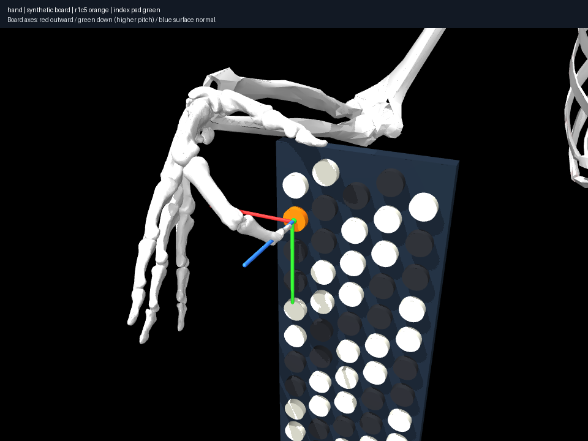

# 001 — Single index fingertip contact

Question and every metric assumption are in [experiment.json](experiment.json).
The pose is generated from fixed generic anatomy and an upright synthetic
62-button board; placement is not adjusted to follow the solution. The board
has diagram-derived topology and assumed metric scale.

```sh
uv run aec experiment experiments/001-single-contact/experiment.json
uv run aec render experiments/001-single-contact/result.json
```

Current published result: [result.json](result.json), four standard views in
[renders/](renders/). Static candidate reached the surface to about 0.059 mm,
with actual fingertip ellipsoid/button contact; coupled joints are exact to
floating-point precision. About 0.033 mm signed penetration is allowed by the
explicit numerical 0.1 mm tolerance. This is not a simulated pressed button.
Near-limit wrist deviation/index abduction show that the chosen local result
should not be called comfortable. All unused digits are frozen at their
starting angles; that is an experimental restriction, not a human limitation.

## Archived failures

These are historical result snapshots, not outputs regenerated by the current
solver. Their joint states remain inspectable; source versions and inputs are
included. The first did not yet record source-code hashes. Rerendering an old
state with corrected cameras is possible, but the exact old solver iterations
are not reconstructible from these snapshots alone. Do not pretend otherwise.

| Archive | Outcome | Explanation |
|---|---|---|
| [failed-marker](failed-marker/result.json) | Invalidated apparent success | Marker used an uncompiled quaternion. It hovered rather than touching. Old camera viewed board rear. |
| [failed-volar-support](failed-volar-support/result.json) | Failed | Resolved capsule support in volar direction selected its proximal pole; middle phalanx penetrated target ~1 mm. |
| [failed-capsule-only](failed-capsule-only/result.json) | Failed | Correct distal capsule pole ignored the overlapping ellipsoid; ellipsoid penetrated target ~3 mm. |



The final surface is the maximum support of the compiled distal capsule and
ellipsoid in the capsule's distal-axis direction. The marker frame's +z is the
outward surface normal. Its local coordinates/quaternion are saved. This is a
model-derived proxy; its suitability for real fingertip contact needs validation.

IK's linearized collision avoidance is a search aid. Independent final checks
use actual MuJoCo contacts; the final acceptance includes position/normal,
contact distance, joint limits, couplings and maximum penetration. Neither
these endpoints nor the solver trace prove a continuous valid playing path.
