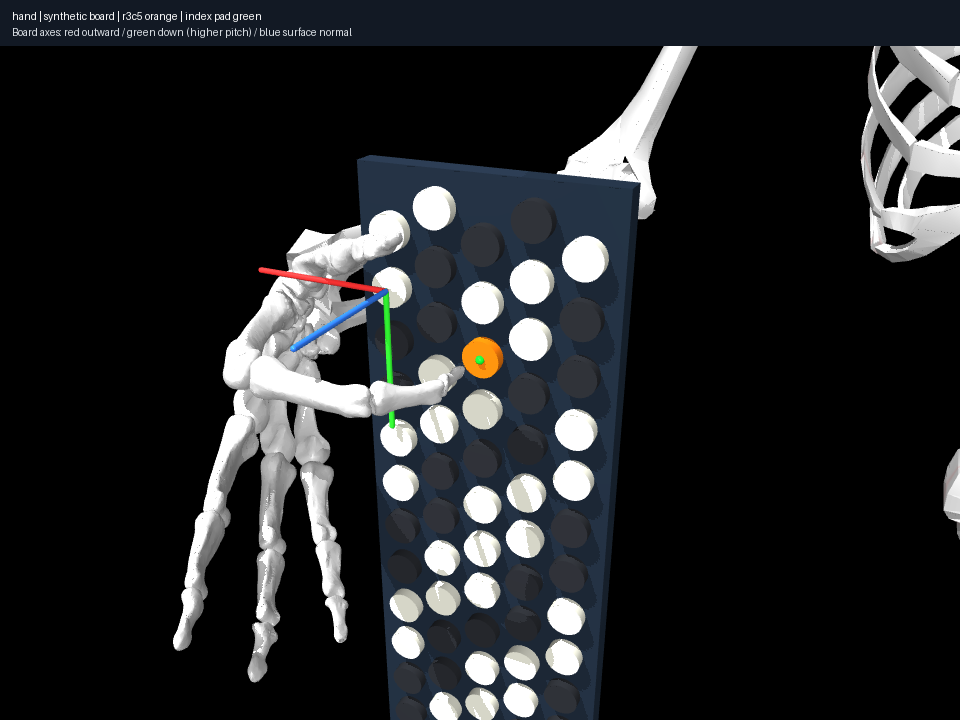

# Contact diversity falsifies a necessary wrist-limit interpretation

Eleven deterministic starts per target (baseline plus ten recorded independent
joint offsets) discover six distinct r3c5/D4 poses and seven r1c9/C5 poses.
Invalid starts and failed solves are retained. Deduplication uses palm/elbow
position and wrist/shoulder/forearm/finger configuration thresholds, explicitly
numerical grouping decisions rather than comfort criteria.

For D4, baseline-start wrist margins are 0.45° deviation / 0.73° flexion.
Start 7, with elbow and forearm initialization shifted -0.4 rad each, discovers
5.19° / 10.84° margins. Its palm relocation is 70.1 mm versus 29.6 mm.
Thus the earlier near-limit wrist pose was not inevitable; a different
configuration trades more relocation for wrist margin. This does not prove
comfort or representative human fingering. Other active joints remain close to
modeled limits; frozen unused fingers at their bounds must not be silently
used as an overall discomfort indicator.



C5 candidates span 60.3–178.3 mm palm relocation. Local posture regularization
selects different configurations depending on its initialization. No first
success is designated “the human pose”. Joint margins include all coordinates;
active-arm/index margins are reported separately.

Each candidate can be rendered from its result.json. Discovery definitions,
resolved profiles/model hashes, all start offsets, solver outcomes, states and
runtime cost are stored. Solver iteration history is not a physical trajectory.

```sh
uv run aec explore experiments/005-pose-diversity/experiment.json
```
