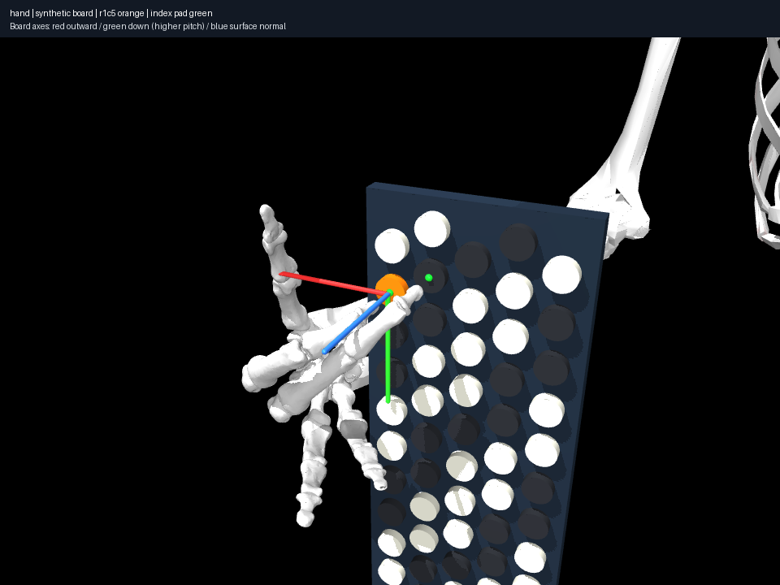

# Two simultaneous rigid-proxy contacts

Index r1c5/C4 plus middle r2c4/B♭3, and index r1c5/C4 plus middle r2c5/C♯4,
have accepted static candidates. Both fingertip/button distances, both contact
normals, all joint limits/equalities and detected penetrations pass. Maximum
marker errors are 0.0216 and 0.0152 mm. This establishes the small simultaneous
formulation under assumed geometry; it does not certify playing feasibility.



**Visual interpretation:** the discovered palm configuration is markedly
reoriented compared with the monophonic baseline. The skeleton view is unusual
for a playing gesture. It is retained as evidence of incomplete physical and
posture constraints, rather than hidden with a difficulty weight. Anatomical
contact location, appropriate finger pulp/approach and representative human
arm/setup poses need validation before ergonomic claims.

**Invalidated investigation:** the middle marker initially used a NumPy view
of a scratch rotation matrix. Computing the ellipsoid orientation overwrote
that view, selecting a support point ~7.5 mm inside the intended outer envelope.
Several apparently informative dual-contact failures were therefore invalid
model evidence. The [archived faulty result](invalid-marker/result.json) and
executed source snapshot preserve the error; it is marked `invalidated`.
Copying the axis fixes it. The new invariant checks both distal shapes for each
digit. A second regression prevents acceptance when only the index contact is
valid; a positive regression requires both actual distances to pass.

```sh
uv run aec frozen experiment experiments/009-two-contacts/r2c4/experiment.json --output artifacts/two-contact
uv run aec frozen experiment experiments/009-two-contacts/r2c5/experiment.json --output artifacts/two-contact-csharp
```

No held-contact trajectory has yet been established.
