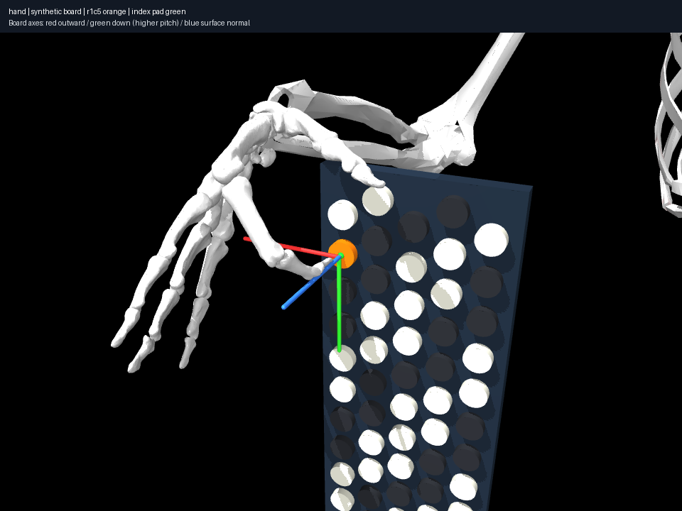

# Hand-size sensitivity under a controlled geometric hypothesis

The wrist-origin transform affects all hand geometry by ±5%; forearm/upper arm
and wrist attachment stay fixed. This is **not physiological personalization**.
All muscles/tendons are removed for both scaled cases and the unit-scale control.
Source axes, angular ranges and couplings remain imported assumptions.

Eight identical index queries, with source C4 recalibrated for every profile:

| Geometric hand factor | Sampled transitions / 8 | Changed outcomes | Largest common relocation change |
|---|---:|---:|---:|
| 1.00 | 8 | — | — |
| 0.95 | 7 | 1 | 41.54 mm |
| 1.05 | 8 | 0 | 21.57 mm |

At 0.95, no pose is found for r5c3 under these starts; C5/r1c9's discovered palm
relocation increases by 41.54 mm. At 1.05, r2c6's best discovered relocation
falls by 21.57 mm. These do not prove different human limits or a minimum-motion
law. Joint/pose discovery and the rigid proxies are part of the result.



The transform is tested against compiled geometry at identical joint states:
hand landmark/contact offsets scale exactly about the fixed wrist; arm/forearm
positions and source angular ranges are unchanged. Primitive radii, mesh assets,
site offsets and inertial geometry transform together. Shared external meshes
or unexpected frame/anchor arrangements reject the transformation.

```sh
uv run aec frozen sweep experiments/010-hand-geometry-sensitivity/experiment.json --output artifacts/hand-sensitivity
```

This establishes a replaceable geometric sensitivity input, not a shortcut from
one player's measured palm width to a biomechanically valid MyoArm personalization.
