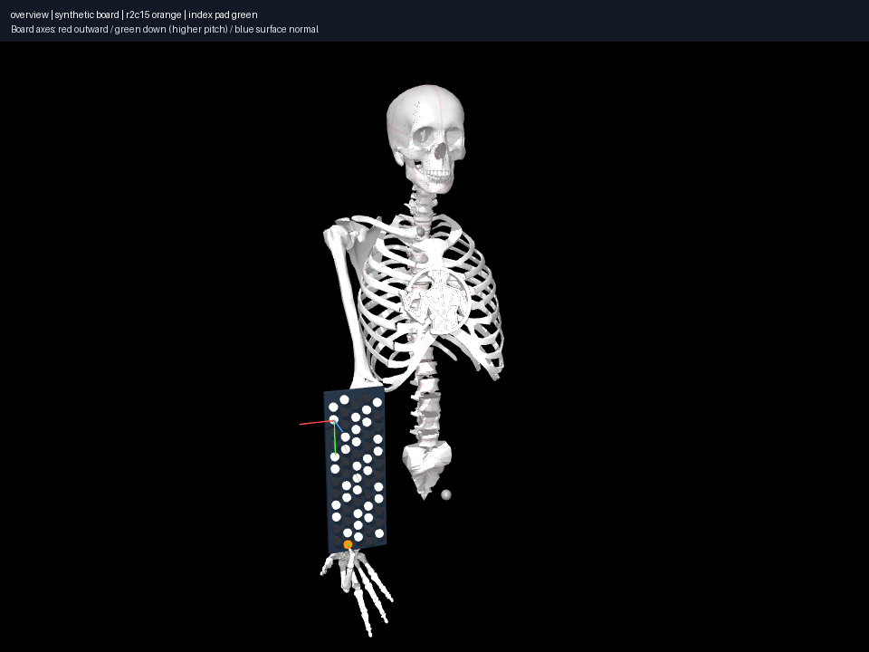

# Select a demanding model action from physical movement

The finite index atlas selects r2c15/G6 from recorded r1c5/C4 by the largest
**best discovered endpoint palm relocation**, rather than MIDI interval size.
The chosen realization moves the palm 300.29 mm; its sampled palm path is
480.12 mm. A finer 0.001 rad edge audit checks 2,230 samples and retains the
0.03583 mm maximum detected penetration under the 0.1 mm tolerance.

This selects a demonstrated realization, not an action proved to require at
least that movement. A different endpoint/search could discover less relocation.
The exported endpoint input and diagnostics independently agree on its actual
G6 target; state/action/trajectory records preserve explicit finger bindings,
parameters, source archives and dependency metadata. Contact events are
musically shallow; no tempo, button operation or human exercise prescription
is inferred.

Reproduce with `uv run aec frozen exercise
experiments/012-large-relocation/experiment.json --output artifacts/012`.
The atlas dependency and per-action evidence are hash checked. Four standard
views plus proxy views show source/middle/destination. The hand camera is fixed
at the destination and can clip the source; overview/keyboard show that state.
[014](../014-collision-coverage/notes.md) finds unchecked anatomical proxy overlap,
so the motion is accepted under the existing collision coverage, not established
fully collision-valid or human feasible.
