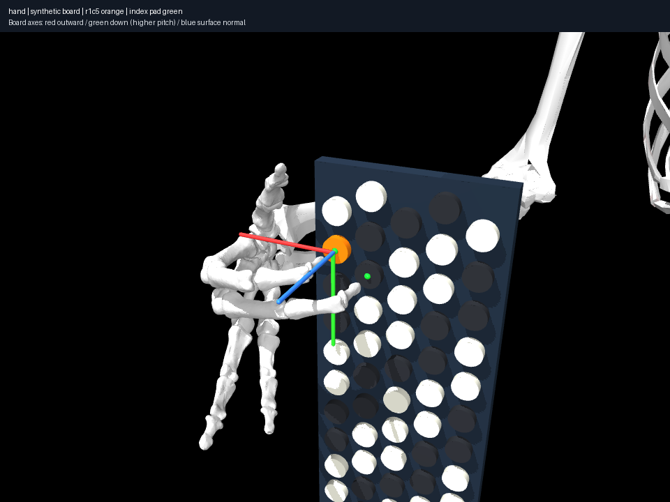

# Keep index contact while middle changes buttons

Start with the recorded index C4 + middle Bb3 gesture and seek index C4 + middle
C#4. Direct joint interpolation passes the existing collision/limit/coupling
audit, but loses held index contact by **25.66 mm**. Contact requirements must
be audited along the path, separately from collision checks.

Incremental 1 mm Cartesian waypoints withdraw middle 10 mm, translate 19 mm
along the board and approach C#4 while constraining index position, direction
and actual envelope/button distance. Forty-three configurations yield 855
samples at 0.001 rad edge resolution; maximum held marker error is 0.08307 mm
and detected penetration 0.02005 mm. A regression re-audits at 0.0005 rad.
The resulting gesture is independently solved/revalidated and exported.
It differs from the supplied destination pose: continuation discovered another
endpoint rather than forcing a particular local-IK posture.

Reproduce with `uv run aec frozen held
experiments/013-held-index-transition/experiment.json --output artifacts/013`.
This is geometric holding, not holding force or button depression. Unsampled
intervals remain unknown. [014](../014-collision-coverage/notes.md) detects
unchecked finger proxy overlap in these gestures; the finding demonstrates
held-task solving under incomplete constraints, not human simultaneous feasibility.
