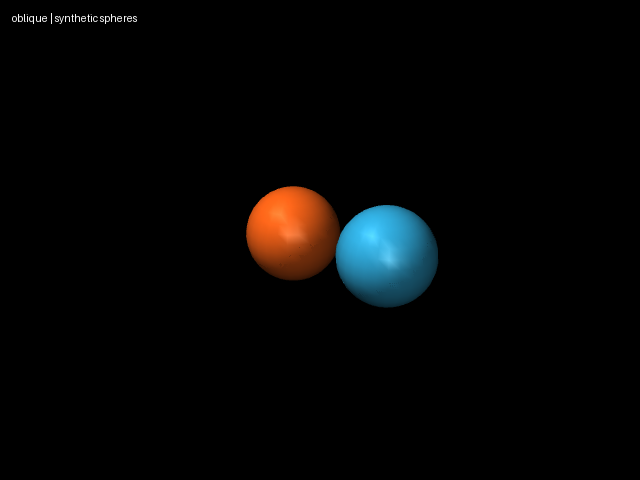

# A dependency-level collision falsification

The locked Mink 1.3.0 QP solves for displacement and returns velocity by dividing
the answer by dt. Its collision inequality instead bounds displacement by
`gain * gap / dt`. A synthetic 10 mm gap between 10 mm-radius spheres closes
all the way to a 20 mm overlap at dt 0.01, 0.02 and 0.1 s. At dt 1 s it retains
the expected 1.5 mm gap. A world-anchored variant has no native constraint pair
at all, because the parent filter incorrectly removes the world/top-level pair.

The project displacement adapter uses `-gradient(distance) * delta_q <=
gain * max(distance - minimum, 0)`. Every recorded timestep retains about
1.5 mm in both fixtures. Signed gradients match finite differences for separated,
penetrating and touching spheres; touching uses a freshly computed engine normal
because Mink updates kinematics without collision detection. Named explicit
pairs can bypass masks; world pairs receive the correct parent-filter exemption.
No anatomical shape, range or ergonomic weight changes.

Reproduce: `uv run aec frozen limit-probe
experiments/016-displacement-limit-probe/experiment.json --output artifacts/016`.
Fixture XML, metre/radian distinctions, dt, matrices, package/model/source hashes
and four headless views are recorded. These are numerical fixtures, not anatomy.
The installed stable package remains locked. The upstream
[unreleased changelog](https://github.com/kevinzakka/mink/blob/main/CHANGELOG.md)
documents both defects; PyPI still reports 1.3.0 as latest on 2026-10-08.
The [public Limit contract](https://kevinzakka.github.io/mink/api/limits.html)
allows the adapter without patching the dependency.

New solver settings default to `displacement`. Importing published input without
the implementation field preserves `mink_native` semantics and historical
profile hashes; new corrected inputs must identify the implementation explicitly.
Correct local units are necessary but not sufficient: see experiment 017.
