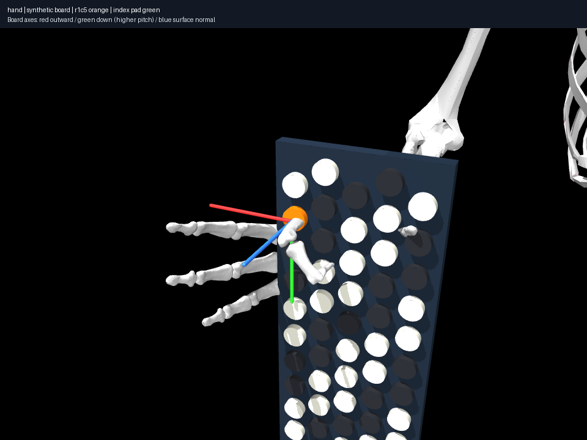

# Correct collision units do not solve nonlinear motion

This repeats the single-contact problem with unchanged geometry and the
displacement adapter, including imported explicit thorax/arm pairs. It fails
after 200 iterations: 33.52 mm marker error, 11.20 mm detected penetration.
The starting configuration is collision-clear. The compiled model matches the
legacy fixture: this is a solver change, not a geometry change.

The adapter constrains only pairs already within the 30 mm activation band.
An unconstrained large joint displacement can cross that band between iterates,
then become trapped with an already penetrated state. The corrected local bound
prevents further first-order closing; it does not mandate penetration recovery
or establish nonlinear edge validity. This failure does not make C4 impossible:
the accepted archived endpoint remains available.

Reproduce with `uv run aec frozen experiment
experiments/017-corrected-contact/experiment.json --output artifacts/017`.
Expected exit status is 1, with state/history/renders saved. Original executing
source is archived. Next: independently validate proposed integration edges and
backtrack unsafe solver steps, then investigate selected phalangeal constraints
without changing imported envelopes. No collision tolerance was relaxed.
