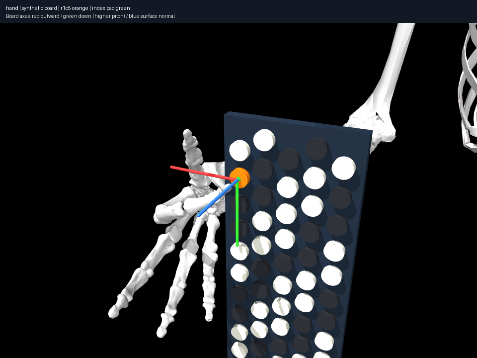

# Check nonlinear solver steps, not only active local inequalities

Using the same initially clear configuration, imported geometry, task weights
and 0.1 mm penetration tolerance as 017, sampled edge backtracking reaches C4
in eight iterations with 0.04833 mm marker error and zero detected penetration.
Two proposed steps are halved. The local limit alone in 017 had ended with an
11.20 mm penetration; proposed integration edges can cross its activation band.

The displacement implementation checks joint-interpolation edges at a configured
0.01 rad maximum coordinate step, halving unsafe displacements up to 12 times.
Colliding seeds receive an explicit initialization failure. A regression uses
clear endpoints separated by a colliding rotational arc: endpoint-only checks
would accept the unsafe full step. This is sampled numerical iteration safety,
not a timed playing trajectory or a certificate for unsampled intervals.
Mink-native legacy mode retains its historical integration behavior.

Reproduce with `uv run aec frozen experiment
experiments/018-collision-step-backtracking/experiment.json --output artifacts/018`.
Only solver behavior changes; the compiled physical model matches 017 and the
original fixture. General anatomical self-collision remains unchecked until
specific additional proxy pairs are declared.
