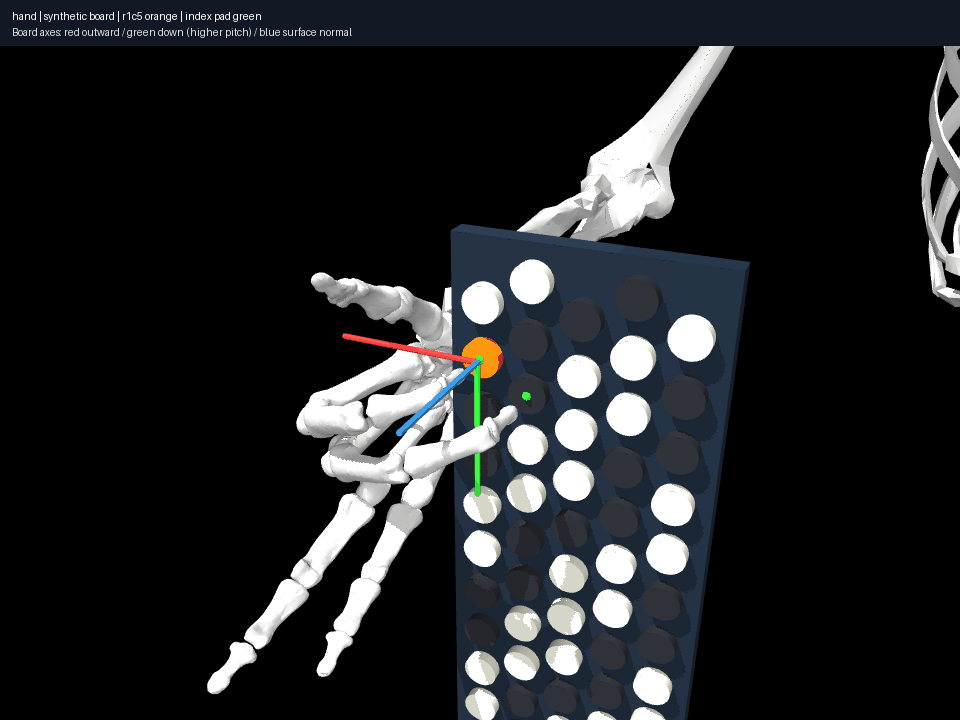

# Held index contact with 16 selected self-pairs enforced

Hold index C4 while middle moves C#4→E4, starting from a discovered constrained
dual pose. Both supplied endpoints are accepted under the same compiled model.
Direct joint interpolation passes collision/limit/coupling and selected-pair
checks but loses held index contact by **4.31 mm**.

Incremental 10 mm withdrawal, 19 mm translation and approach discovers 42
configurations. Its 1,014-sample audit retains index contact within **0.07104 mm**;
maximum detected penetration is 0.02545 mm under the unchanged 0.1 mm tolerance.
Independent distance queries check all 16 selected pairs at every sample:
minimum sampled signed separation is **0.04043 mm**. Distances above the query
cutoff are recorded as lower bounds. A twice-finer regression also passes.
Palm path length is 38.39 mm and maximum excursion 13.14 mm; these describe
this realization rather than a globally minimized movement.

Reproduce with `uv run aec frozen held
experiments/022-held-contact-with-self-pairs/experiment.json --output artifacts/022`.
Nine actual sampled states form the animation; its 180 ms frame duration is
display timing, not a tempo prediction. Source/middle/destination have all four
standard views and proxy views. The resulting two-contact gesture is separately
revalidated/exported. Numerical solves now also record their effective settings,
including iteration-budget overrides.

A fault-injection regression removes engine pair registration while declaring
a pair in the profile: independent distance auditing rejects the overlapping
pose even when the ordinary engine audit passes. This closes a demonstrated
diagnostic gap. Other finger/palm/body collision coverage, envelope calibration,
button operation, force and unsampled intervals remain unresolved. The motion
is a constrained-proxy result, not a validated human performance.
