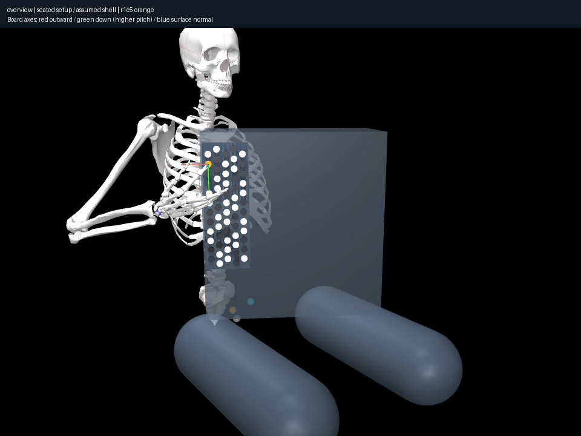
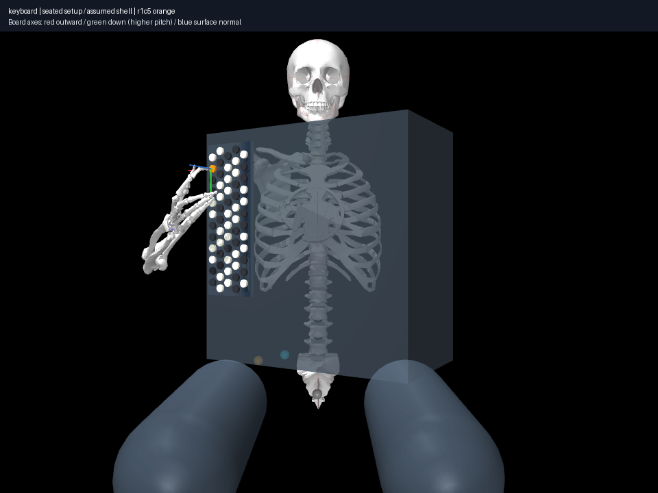
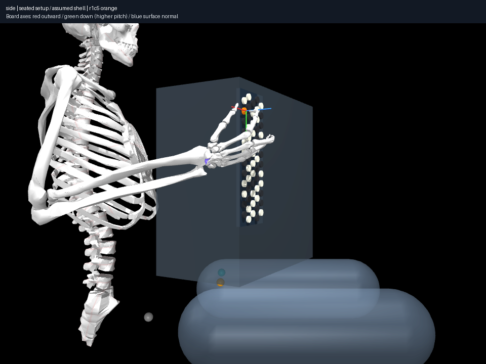
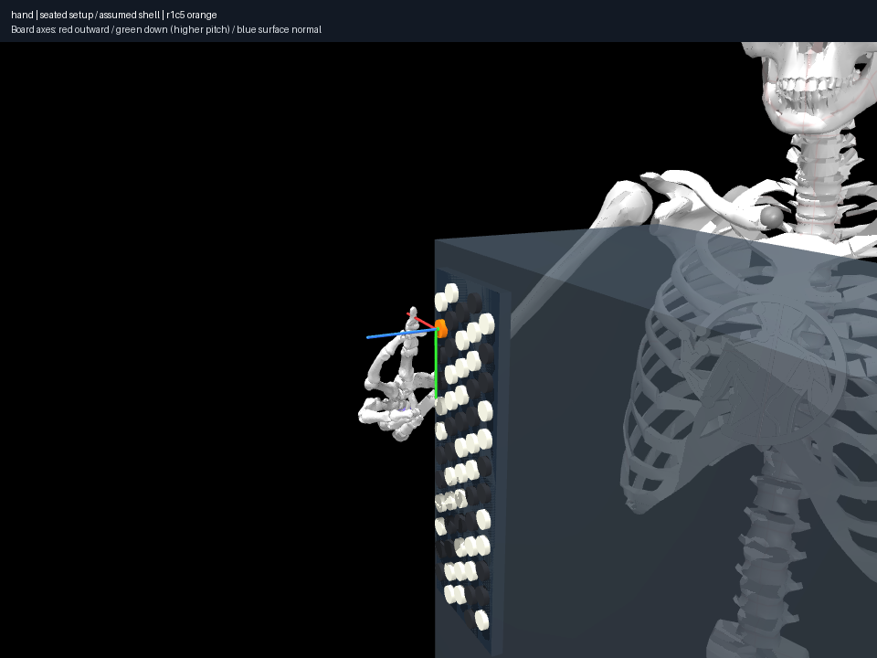
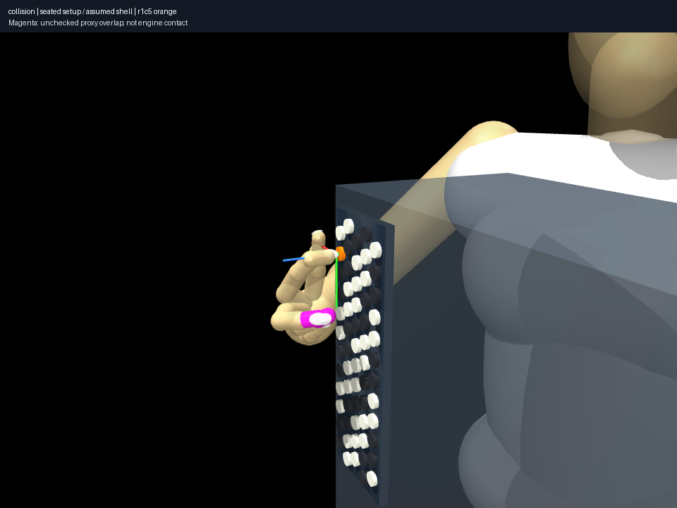

# Body-anchored generic compact CBA reference

Reproduce: `uv run aec frozen experiment experiments/023-reference-seated-setup/experiment.json --output artifacts/023`.
Audit: `uv run aec frozen collision-coverage experiments/023-reference-seated-setup/coverage/experiment.json --output artifacts/023-coverage`.
Replay: `uv run aec render experiments/023-reference-seated-setup/result.json --output artifacts/023-replay`.

[Public provenance, setup equations and broad family](../../docs/research/seated-setup.md)
separate manufacturer size from assumed mount registration, support anatomy and
angle ranges. This is a generic seated hypothesis, not personal calibration.
The keyboard lattice is still the synthetic 19 mm fixture. Full straps, moving
bellows, shaped case, left arm and dynamic support are absent.

## Placement compared to the historical fixture

Values below are rounded observations of the implemented worlds, not precise
posture recommendations. Neutral shoulder means the imported qpos0 joint frame.
Absolute root height changes from 1 m to 650 mm solely for seated visualization;
comparisons subtract the corresponding shoulder/root.

| Quantity | Historical 018 | Reference 023 |
|---|---:|---:|
| C4 base minus neutral shoulder, right/forward/up | 90 / 320 / −224 mm | 0 / 310 / −44 mm |
| Board normal in canonical player frame | (0, 1, 0) | (0.5, 0.866, 0) |
| Button vertical extent relative to neutral shoulder | −433 to −186 mm | −253 to −6 mm |
| Shoulder to C4 surface in solved state | 409 mm | 332 mm |
| Solved wrist deviation / flexion | −7.9° / 30.6° | 11.5° / −1.7° |
| Solved shoulder elevation / elbow flexion | 13.0° / 79.2° | 43.8° / 108.0° |

The principal correction is upward/inward placement, upright instrument scale
and explicit torso/support relationships, not a large forward-distance reduction.
An instrument's depth accounts for much of the old surface-forward offset.
Original board placement alone was insufficient evidence of body support and
placed C4 considerably below the compact instrument's upper-torso region.
The previous fixture remains useful historical laboratory evidence.

**These solved-pose numbers are not a controlled setup-only experiment.** This
reference also allows inactive-digit articulation, starts curled fingers and
adds the 019 index/middle pair hypothesis. Matched-policy and pose-diversity
comparisons follow in 024–025; do not attribute every joint change to placement.
The new view has a side arm approach and elbow away from the ribs; wrist flexion
is straighter but deviation is larger. No comfort score is inferred.

## Numerical validation and falsification

C4/index converges: marker error **0.03922 mm**, actual distal-envelope/button
separation **0.03826 mm**, normal error within 0.05 rad, all 11 coupling residuals
≤5.56e-17 rad, no joint violation or registered penetration. Independent distances
to the solid shell are ≥4.038 mm over all 36 anatomical proxies. Thorax 1/2/3
separations are 38.40/18.39/71.75 mm. The lower treble reference is 47 mm from
schematic inner-thigh reference; shell bottom is 10 mm above support height.
Neither reference is a measured contact or a support force equilibrium.

**The anatomical audit rejects a stronger interpretation.** Seven unchecked
middle/ring phalangeal overlaps remain; the largest is **8.68 mm**. The index/
middle selective policy does not cover this pair. Allowing other digits to
articulate can improve arm orientation while worsening omitted collisions.
This is not a collision-valid full human pose. The coarse setup geometry is the
validated implementation milestone; hand envelopes remain an unresolved boundary.
No proxy was shrunk and no blanket self-pair policy was enabled to hide it.

All four diagnostics were inspected and reproduced from the saved state; replay
uses the compiled-model safeguard. Both frozen records pass `aec verify
--require-complete`; 75 tests, Ruff and ty pass. Integrity and marker convergence
do not establish biological validity. No public media are committed.
