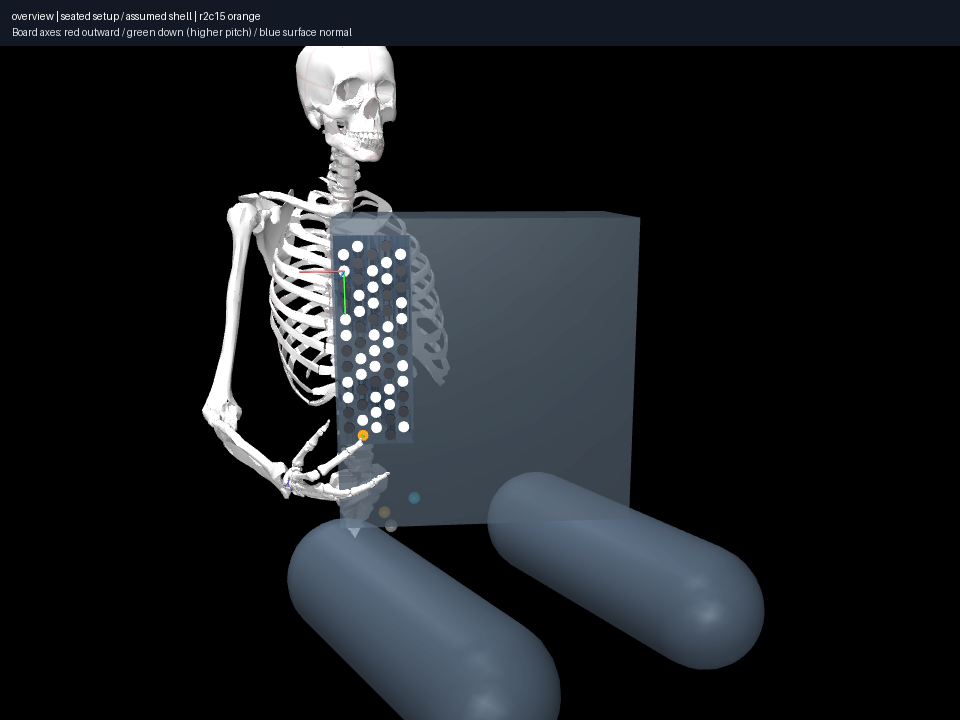
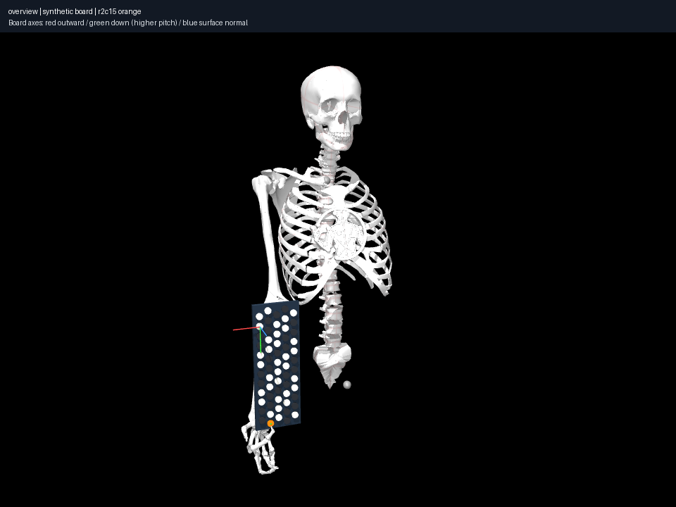

# Placement family, matched-policy synthetic control and selected large relocation

Reproduce: `uv run aec frozen sweep experiments/024-seated-setup-family/experiment.json --output artifacts/024`.
The prototype and per-case files preserve deterministic three-start searches,
120 iterations per start, displacement limits/edge guards, allowed inactive-digit
articulation and the same 16 index/middle pairs. Every case **re-solves C4** from
the same joint-vector prior before declaring a parameter-bound playing state.
States from the old world are not accepted as new-world contacts.

Eight generic seated members are sampled, plus a synthetic control. The latter
preserves the old board-to-shoulder transform with a 350 mm world translation
applied to both torso and board; it also uses the matched new digit/pair policy.
The seated cases add the coarse instrument envelope, so this comparison changes
both placement and shell coverage. It is not an isolated shell-shape experiment.
See [parameter provenance](../../docs/research/seated-setup.md).

## Discovered movements and sensitivity

Best discovered endpoint palm relocation, mm, among sampled-path realizations:

| Setup | C4→D4 (r3c5) | C4→C5 (r1c9) | C4→G6 (r2c15) |
|---|---:|---:|---:|
| Reference | 50.22 | 73.76 | 170.20 |
| Synthetic, matched policy | 119.71 | 151.75 | 320.24 |
| Rear gap 30 mm (+20 mm) | 57.55 | 60.45 | 153.22 |
| Treble edge outward 30 mm | 31.77 | 48.24 | 108.98 |
| Support height lower 30 mm | 35.34 | 34.30 | 213.88 |
| Yaw 0° | 213.06 | 55.97 | 185.64 |
| Yaw −45° | 43.89 | No pose found | 117.90 |
| Side tilt +10° | 49.88 | 20.71 | 201.00 |
| Fore/aft tilt +10° | 40.08 | 36.87 | 176.33 |

All cases find D4 and G6 transitions. G6 discovered relocation remains above
100 mm among these sampled realizations, but **this is not a lower bound on
required movement**. Its 109–214 mm range within the setup family and 320 mm
synthetic result rule out treating one placement's movement magnitude as a
universal ergonomic property. The spatial keyboard target separation is unchanged.

Two apparent sensitivities are falsified by [027](../027-yaw-search-refinement/notes.md)
without changing geometry or collision tolerances:

- −45° yaw C5: four poses and a direct sampled path appear with expanded starts;
  best discovered relocation is 62.54 mm. The missing coarse result is a search
  budget/initialization effect, not a demonstrated physical yaw boundary.
- 0° yaw D4: expanded starts find a **19.16 mm** relocation and direct sampled
  path rather than 213.06 mm. A large movement on a nearby button was a solver
  branch, not established movement necessity.

The other quantitative changes combine placement, calibrated-source branch and
finite target/path search. Distinguish **stable discovered existence** from
**sensitive discovered magnitudes**, and do not infer human board reachability
from 27 queries or the original sparse failures.

## Physical and visual checks

Four saved-state views were rendered and inspected for all nine cases under
`CASE/anchor/renders/`. The shifted synthetic control's historical fixed camera
was cropped; supplementary `synthetic-matched-policy/anchor/replay/` follows the
translated torso. Its render manifest records the actual renderer source/model
hashes; the same renderer source is archived in 028. Numerical records are unchanged.
The camera translation regression preserves original unshifted cameras.

Family views keep the shell near the upper torso and lower support region, with
an upright/modestly tilted board. Different anchor solutions produce visibly
different arm branches. A plausible gross setup does not make every discovered
hand pose ordinary or collision-valid. Schematic thighs do not certify load
support, and the catalogue-sized solid shell can exclude space a shaped case has.

Selected G6 states are independently replayed in each control's `g6-endpoint/`,
with hashed action links and explicit fingers. Both succeed; their four views
were inspected. New G6 has a bent-elbow side approach near the support region;
the old fixture sends the hand much farther below the upper torso. Independent
[028 coverage](../028-seated-collision-coverage/notes.md) still finds unchecked
phalangeal overlaps of 9.36/9.48 mm in those endpoints. No human feasibility claim.

The sweep and both endpoint frozen records pass complete integrity verification.
Solver-iteration history is not a playing trajectory; action files preserve the
actual sampled paths. Source/profile/model hashes identify all physical worlds.
