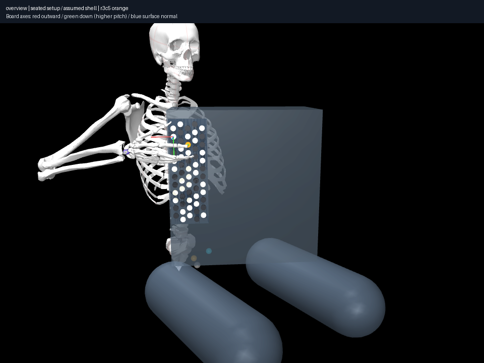
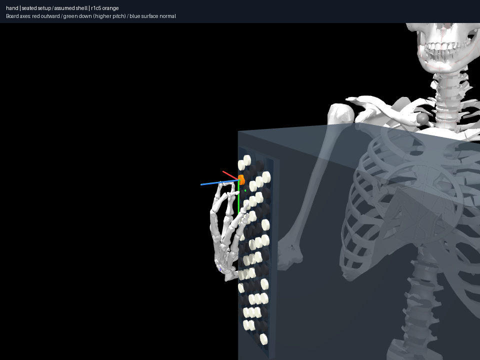

# Pose diversity and two-finger contacts in the seated setup

Run `uv run aec frozen explore experiments/025-seated-pose-diversity/CASE/experiment.json --output artifacts/025-CASE`.
Each case uses eight deterministic starts, 180 iterations, unchanged envelopes,
explicit displacement/edge settings, allowed inactive-digit articulation and the
same 16 index/middle pairs. Index/middle contacts are explicit, never inferred
from a marker-only state label.

`reference` starts from accepted seated C4 in 023.
`synthetic-recalibrated-anchor` starts from its **own accepted synthetic C4** in
024. `synthetic-matched-policy` preserves an additional transfer control: the
same numeric prior from 023 is supplied in the synthetic world and re-solved for
each target. That vector is an initialization prior, **not a declared C4 playing
state there**. Its `relocation_m` is seed-to-candidate displacement and must not
be presented as a C4 action. Use 024's physically recalibrated transition metrics.
All resulting candidates have their actual world's profile/model hashes.

| Target | Seated reference distinct poses | Synthetic own-C4 distinct poses | Synthetic transferred-prior poses |
|---|---:|---:|---:|
| C4 / index | 4 | 4 | 6 |
| Nearby D4 / index | 3 | 5 | 2 |
| C4 index + C#4 middle | 4 | 5 | 5 |
| C4 index + E4 middle | 4 | 4 | 4 |

Fewer or more discovered poses does not measure true feasible-set size. The
transfer comparison makes search initialization sensitivity visible.

## Arm/wrist character

Among accepted own-anchor candidates, wrist **flexion** spans −5.3° to +2.0° for
seated C4, versus +5.3° to +43.9° for synthetic C4. Nearby D4 spans −2.5° to
+20.3° seated, versus +44.0° to +44.7° synthetic (45° is the imported upper bound).
The latter near-limit candidates are not representative evidence of how an
ordinary player must reach D4. New central/nearby contacts have side approaches
and less required wrist flexion among discovered candidates, but shoulder/arm
branches vary. The numeric ranges describe this imported model, not comfort.

The correction does **not** solve every posture issue: C4+C#4 candidates in both
worlds can reach 25° deviation and 45° flexion limits; a seated branch instead
has −40.6° flexion. C4+E4 is less flexed in the seated discoveries (8.7–22.6°),
but still not observed human evidence. Synthetic lattice spacing, rigid distal
support/normal formulation, proxy anatomy and seed/posture bias remain plausible
causes of unusual dual poses. No instrument/anatomical parameter was adjusted
to force the two-finger pictures to look attractive.

All candidates retain diagnostic views and collision overlays. Four views of
the representative nearby and selected dual-contact branches were inspected.
[028](../028-seated-collision-coverage/notes.md) independently audits every
candidate across all three cases; none establishes full anatomical clearance.

All three frozen exploration roots pass complete integrity checks. The baseline
pose, parameter patch, solver settings, attempts (including failures), grouping
thresholds and all candidate states remain rerunnable. Candidate counts are
finite-search evidence; static convergence is not a musical trajectory.
