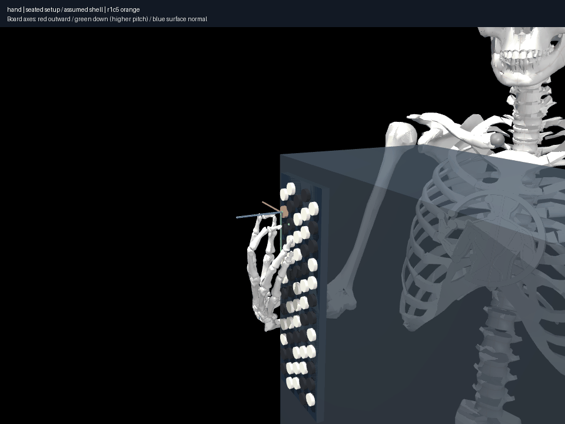

# Held C4 while middle moves C#4→E4

Run `uv run aec frozen held experiments/026-seated-held-contact/CASE/experiment.json --output artifacts/026-CASE`.
Each case chooses, **before path search**, the accepted endpoint pair with the
smallest maximum absolute joint-coordinate difference. `selection.json` retains
all pair costs; this numerical selection is not an ergonomic score. The recipe
uses 10 mm withdrawal, 1 mm Cartesian increments, 200 waypoint iterations and
1 mrad audit sampling. Profile/model/contact guards independently check endpoints.

| Case | Direct held-contact error | Searched outcome | Palm path / excursion |
|---|---:|---|---:|
| Seated reference | 9.97 mm | Sampled held path | 65.82 / 60.72 mm |
| Synthetic, transferred numeric prior discovery | 1.92 mm | Sampled held path | 44.72 / 21.93 mm |
| Synthetic, own recalibrated C4 discovery | 6.32 mm | No held path in this realization | Not a valid completed path |

Direct interpolation fails the held-contact requirement in all three cases.
The reference searched path has 687 samples, held error ≤0.07908 mm, detected
penetration ≤0.00388 mm and independently queried selected-pair separation
≥0.000302 mm. The successful transferred-prior synthetic path has 676 samples,
held error ≤0.06478 mm, penetration ≤0.04247 mm; one selected proxy pair overlaps
by that amount within the unchanged 0.1 mm model tolerance. Neither certificate
establishes full hand clearance, force, operation or unsampled validity.

Both successful cases reproduce at 0.5 mrad sampling (`CASE/finer-audit/`):
1,308 / 1,293 samples, unchanged peak held errors/penetration. These reruns retain
frozen code and inputs rather than presenting solver iterations as motion.

The own-anchor synthetic realization fails at the end of the translation leg
with `waypoint_solver_no_solution`. Its partial-path interpolation also loses
held C4 by 0.624 mm. Failed waypoint qpos, partial samples and four last-state
views are retained; the partial palm path is not a valid playing trajectory.
Other synthetic initialization discovers a successful path, so this failure
cannot be attributed to instrument spacing or human impossibility.

The new setup's successful palm path is **longer**, not uniformly better than
the successful synthetic branch. Placement, endpoint branch and initialization
matter. It is not defensible to claim all motions become easier with this setup.

Four source/last-state views were inspected. The resulting gesture is exported
with explicit index/middle contacts and independently re-solved. 028's coverage
finds a remaining unchecked middle/ring overlap of 1.49 mm in its final pose,
versus 3.33 mm in the transferred-prior synthetic final pose. Thus the paths are
limited-coverage kinematic evidence, not collision-valid human actions.

All five frozen roots (three primary cases, two finer audits) pass complete
integrity verification. Historical 013/022 records are unchanged.
