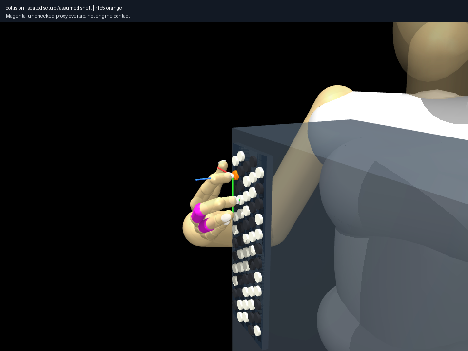
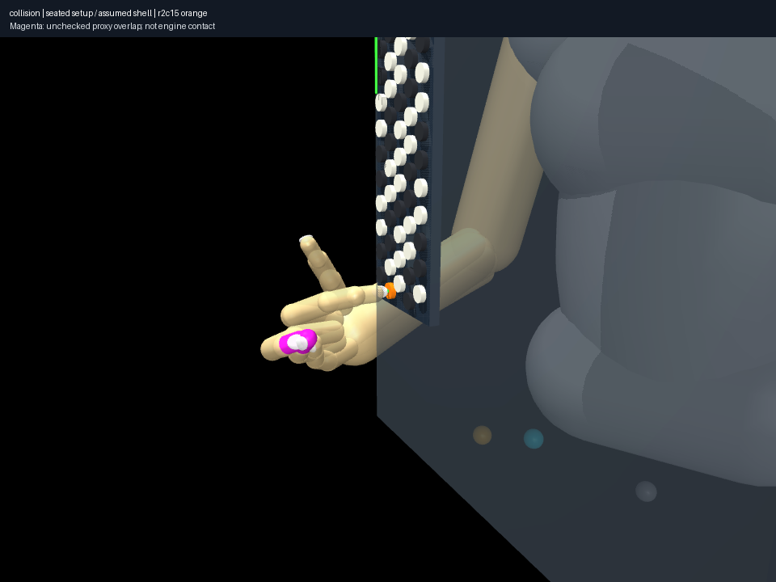

# Anatomy audit after gross setup correction

Reproduce: `uv run aec frozen collision-coverage experiments/028-seated-collision-coverage/experiment.json --output artifacts/028`.
All 73 recorded poses are hash-checked and reconstructed in their actual
compiled worlds: nine setup anchors, 50 pose-diversity candidates, ten refined
yaw candidates, two successful held endpoints and two selected G6 endpoints.
The failed own-anchor synthetic held realization is not relabeled as an accepted
endpoint. Models/profiles, explicit fingers and current audit code are recorded.

**All 73 have at least one cross-digit phalangeal proxy overlap.** The largest
is **13.62 mm**, between middle/ring distal capsules in a refined zero-yaw D4
candidate. These unchanged proxies are not measured tissue, but the omitted
coverage prevents claiming full anatomical clearance. Numerical acceptance,
plausible body placement and lower wrist flexion do not establish human playing.

| Representative endpoint | Unchecked phalangeal overlaps | Largest overlap |
|---|---:|---:|
| Seated held final | 1 | 1.49 mm |
| Transferred-prior synthetic held final | 1 | 3.33 mm |
| Seated selected G6 | 8 | 9.36 mm |
| Synthetic selected G6 | 8 | 9.48 mm |

The added 16 pairs cover index/middle phalanges, not middle/ring and all other
digits. Metacarpal intersections are separately retained rather than blindly
prohibited; some compose a palm envelope. No blanket collision policy or shrinking
of envelopes is used to manufacture an anatomical success.

The new gross instrument/body model is supported by public qualitative evidence
and manufacturer scale. Further claims about actual hand nonpenetration require
public observed/calibrated envelope evidence and contact-formulation checks.
Private personal calibration is not needed to establish this limitation.
The generic family remains useful for comparing model/search sensitivity, with
that explicit boundary. Recorded successful held paths remain limited-coverage
sampled kinematics; their animation durations are illustrative.

The frozen audit passes complete integrity verification. Renderer source for
024's supplementary translated control is the same package hash as this archive.
This checks reproducibility commitments, not the truth of a tissue interpretation.
