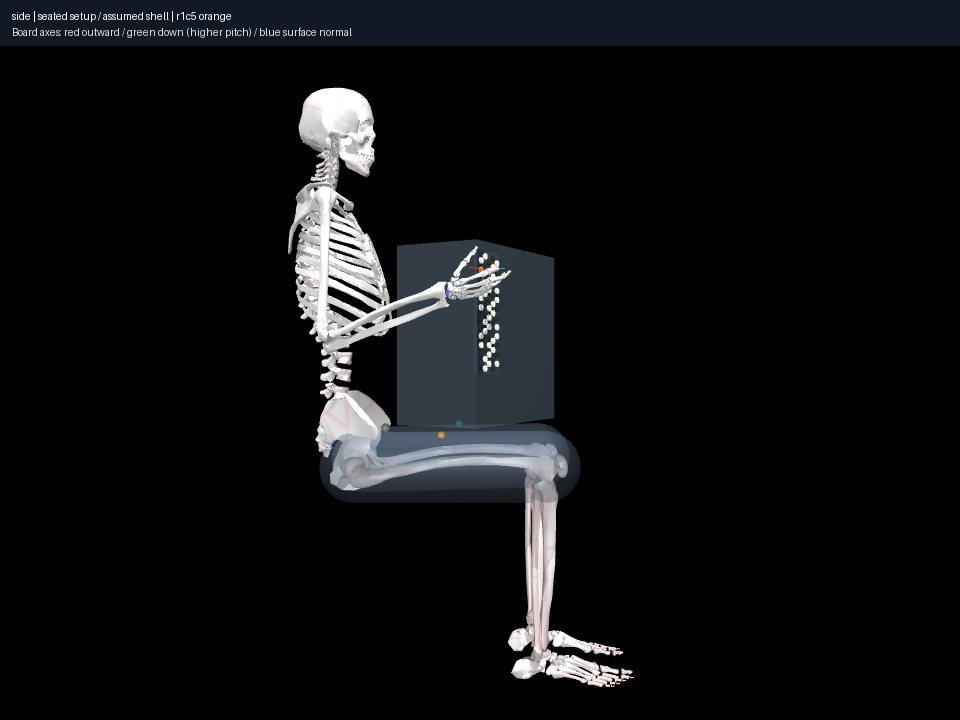

# Fixed MyoSim pelvis/legs and corrected support plane

Use MyoSim anatomical lower-body resources rather than inventing femur placement.
[Research and provenance](../../docs/research/seated-lower-body.md) documents the
standard `myolegs`, reduced `myolegs26` and full-body alternatives. The standard
bilateral pelvis/leg mesh subtree is the smallest useful integration: evaluate
seated hip/knee and all 14 upstream knee/patella couplings, bake compiled
parent-relative transforms, discard lower muscles/joints/tendons/wraps and keep
the established MyoArm torso/right arm. No new libraries or right-arm coordinates.

The nominal fixed pose assumes 90° hip/knee flexion and 5° hip abduction. These
are reference assumptions with a broad exploratory family, not measured universal
posture. White bones are imported anatomy; transparent 75 mm-radius capsules are
approximate support envelopes attached to anatomical hip→knee axes, not skin.

## Before/after geometry and setup

Root height remains 0.65 m and catalogue FR-1xb scale remains 365×195×380 mm.
No root/arm scaling was used to make the new lower-body match the old scaffold.

| Quantity | Historical schematic (023) | Anatomical reference (029) |
|---|---|---|
| Right thigh proximal axis point | (0.160, 0.165, 0.675) m | Imported hip (0.0773, −0.0562, 0.5715) m |
| Right thigh distal axis point | (0.160, 0.485, 0.675) m | Imported knee (0.1106, 0.3447, 0.5777) m |
| Centerline length | 0.320 m assumed | About 0.402 m, imported posed chain |
| Right brace landmark | (0.1000, 0.1646, 0.7500) m | (0.0550, 0.1263, 0.6393) m |
| Brace landmark forward location | Copied from instrument corner | Independent femur station/envelope heuristic |
| Shell center height | 0.9500 m | 0.8527 m |
| Board C4 origin relative to neutral shoulder | (0, 0.3097, −0.0442) m | (0, 0.3097, −0.1415) m |
| Board normal/orientation | 30° yaw hypothesis, upright axis | Unchanged |
| Shell bottom height | 0.7600 m | 0.6627 m |
| Brace-to-treble-corner separation | 47.2 mm | 44.9 mm, not a contact certificate |

The old thigh axis was too far forward, lateral and high relative to the imported
pelvis/hips. The new vertical support plane is the highest femur capsule endpoint
along torso-up plus the assumed radius. This lowers the shell/board by **97.3 mm**
at unchanged root and orientation. Thus adding anatomy also corrects an existing
setup assumption; it does not merely decorate the old floating cylinders.
`comparison.json` contains source quantities and arm diagnostics.

All four views were inspected. Broader cameras now include pelvis, knees and
feet; camera differences mean these images are not a pixel/scale overlay.

| View | Before | After |
|---|---|---|
| Oblique | [023 overview](../023-reference-seated-setup/renders/overview.png) | [029 overview](reference/renders/overview.png) |
| Front | [023 keyboard](../023-reference-seated-setup/renders/keyboard.png) | [029 keyboard](reference/renders/keyboard.png) |
| Right side | [023 side](../023-reference-seated-setup/renders/side.png) | [029 side](reference/renders/side.png) |
| Treble/hand | [023 hand](../023-reference-seated-setup/renders/hand.png) | [029 hand](reference/renders/hand.png) |



## Useful rejected attempt

`rejected-support-plane/` preserves the first frozen solve, input, source and four
renders. It reports solver success, but using the upper-medial brace point height
as the shell-bottom support reference produced **2.00 mm right / 3.47 mm left**
intersection with the approximate capsules. Those static objects have no solver
collision masks, so engine success did not detect this. An independent signed
`mj_geomDistance` query using its archived source reproduced the exact recorded
MJB before measuring; `support-distance-check.json` records the distances.

The correction separates the brace landmark from the conservative vertical plane.
The final reference's independent capsule/shell distances are **11.47 mm right /
10.00 mm left**. No capsule radius or skeletal geometry was reduced to hide the
error. Approximate envelope distances remain separate from anatomy penetration
metrics and are reported even though the envelopes are not collision constraints.

## Arm capability and remaining failures

The central C4 solve has 0.0765 mm marker error, actual distal/button clearance
about 0.0762 mm, zero registered penetration and joint-range violation, and
coupling residual at floating-point precision. Its explicit displacement collision
adapter and sampled step guard retain the existing policy. Arm size remains
38 qpos/38 velocity coordinates, 63 actuators, 11 equalities; the original posed
leg couplings resolve to maximum residual about 2.2e−16 before being baked out.

Shoulder elevation changes 43.8→13.2°, elbow flexion 108.0→101.4°, wrist deviation
11.5→−9.5°, **wrist flexion −1.7→28.9°**. This is not uniformly improved technique.
The changed vertical placement and solver branch both affect these angles.
Eight-start exploration finds two central C4 candidates (wrist flexion 23.7–28.9°)
and three index-C4/middle-C#4 candidates (24.5–44.8°); one dual branch remains
near the wrist-flexion limit. Do not tune the setup merely to produce an attractive
single IK branch. Full four-view candidate renders and failed/deduplicated attempts
are preserved in `pose-diversity/`.

Independent `coverage/` audits all six accepted records (including the repeated
reference candidate) and still finds unchecked phalangeal overlaps in **every**
one, up to about 13.3 mm. Bone legs do not fix finger tissue/collision coverage.
These are kinematic candidates, not certified human playing poses. Lower-body
muscles, dynamics, chair/ground reaction, strap forces and calibrated thigh tissue
are outside this milestone. The bone pelvis improves the seated anatomical frame;
it does not prove loaded support or personal posture.

## Reproduce and validation

```sh
uv sync --locked
uv run aec check
uv run aec frozen experiment experiments/029-myosim-seated-lower-body/reference/experiment.json --output artifacts/myosim-seated
uv run aec render experiments/029-myosim-seated-lower-body/reference/result.json --output artifacts/myosim-seated-replay
uv run aec frozen explore experiments/029-myosim-seated-lower-body/pose-diversity/experiment.json --output artifacts/myosim-diversity
uv run aec frozen collision-coverage experiments/029-myosim-seated-lower-body/coverage/experiment.json --output artifacts/myosim-coverage
```

For the rejected attempt, use its `source-snapshot.zip` with the frozen experiment
command's `--source-snapshot` option; current source deliberately changes its
support plane. Rendering from the final saved qpos reproduced all four PNGs
byte-for-byte in this Mesa/EGL environment; the replay model guard and manifest
are preserved under `reference/saved-replay/`. Software rendering was used after
EGL device permission warnings. 81 tests, formatting, Ruff and ty pass. Tests
compare compiled bone frames/meshes against upstream FK, including a rotated
root, and verify exact historical 023 profile/MJB preservation. All four frozen
roots verify completely; file integrity is separate from physical validity.
