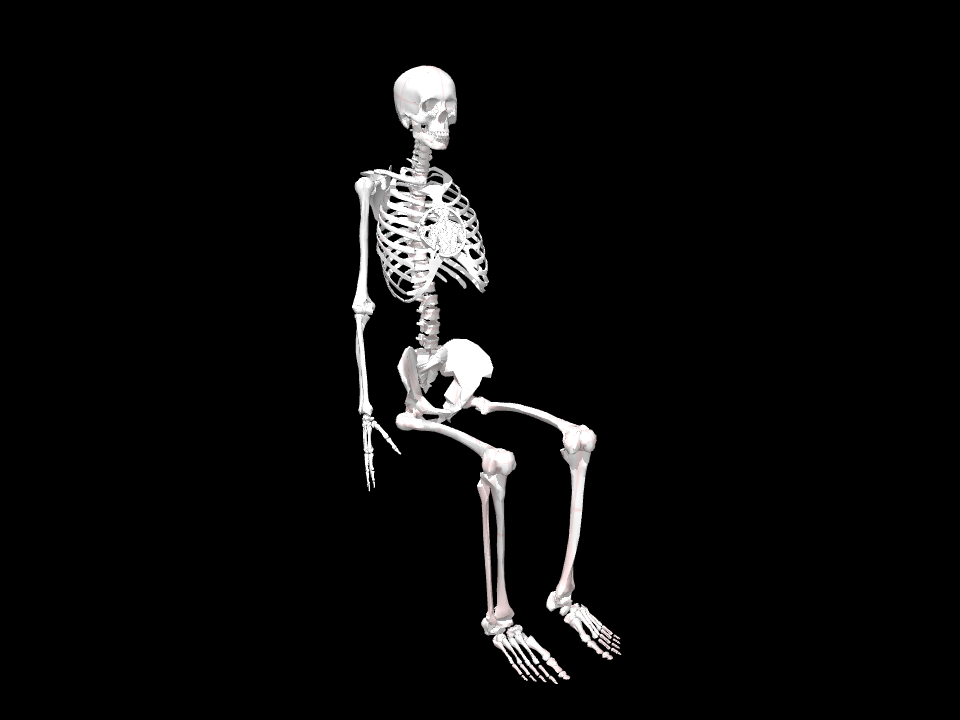
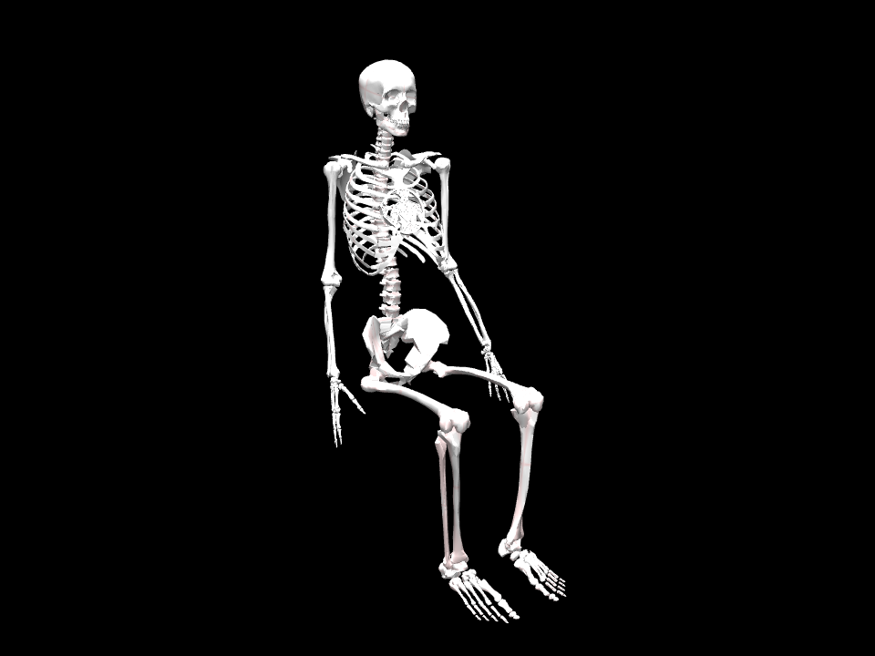

# Adopt a reduced native MyoFullBody foundation

**Decision: Outcome B.** New `PlayerProfile()` instances use
`myofullbody_reduced`: the native MyoSim full-body skeletal assembly, with a
prescribed seated torso/left-arm/lower-body reference baked into fixed transforms
and the original right-arm research chain retained. `myofullbody_native` remains
available as a prescribed-coordinate prototype. Historical inputs retain
`myoarm_r` and their original profile/compiled-world identities.

[Architecture, sources and implementation](../../docs/research/full-body-architecture.md)
describes the actual locked 0.2.3 builder, coordinate mapping, mirrored left arm,
separate sacrum/pelvis attachment, reduction, collision policy and migration.
`result.json` preserves upstream inventories, 18 controlled parity configurations,
all raw benchmark samples, runtime/source/model hashes and artifact commitments.
Each assembly has its own input, saved rest state, benchmark, five body views,
independent replay and canonical C4 solve with four playing diagnostics.

## Controlled right-arm parity

Native full-body uses the same right fragment and passive torso at neutral lumbar
coordinates. Its root defaults to (-0.025, 0.1, 1) m; aligning it to the recorded
world frame removes that difference. Right-body/geometry/marker rotations agree,
as do ranges, joint axes/anchors, all 11 equality coefficients and named links,
63 muscle parameter sets and right-tendon lengths. Bone vertices/faces remain
identical. Joint indices differ in native, so the recorded coordinate map binds
verified names rather than copying arrays.

The reduced model bakes resolved passive FK, including the original rounded leg
attachment frame and polynomial knee/patella transformations. Its controlled
right-arm differences are at floating-point precision. Regression tests also
rotate the root, compare every native/reduced body and skeletal geom at a nonzero
torso/left-arm posture, verify mirrored left landmarks and finite-difference
coupled Jacobians. These establish kinematic preservation, not full-body dynamics
or accuracy against an independently measured person.

## Repeated performance comparison

Five batches in isolated Linux worker processes use the same locked environment,
C4 input, fixed instrument box/lattice, right collision proxies, displacement
limits and 16 existing named finger-pair hypotheses from 029. Imports are warm;
worker processes are separate to avoid cross-architecture RSS accumulation.
Each batch samples 500 FK/full-forward/Jacobian evaluations and repeated distance
queries, five-view renderer creation/drawing, a complete representative C4 solve,
and a local synthetic 2 mm marker relocation from each architecture's own last
C4 endpoint. Raw arrays are in `benchmark.json`
and root `result.json`, including status, iteration counts, diagnostics and
failed attempts if any. Solver histories are numerical iterations, not motion.

| Median / dimension | Existing composition | Prescribed native | Selected reduced |
|---|---:|---:|---:|
| Complete scene setup | 1.427 s | 1.403 s | 2.399 s |
| Prepared anatomy compilation | 64.700 ms | 120.076 ms | 111.389 ms |
| FK only | 22.803 µs | 36.883 µs | 36.830 µs |
| Full forward | 0.173 ms | 0.666 ms | 0.183 ms |
| Right pad Jacobian | 3.113 µs | 3.139 µs | 3.001 µs |
| 2304 right/fixture distances | 2.461 ms | 2.475 ms | 2.424 ms |
| Five body PNGs | 1.576 s | 1.355 s | 1.366 s |
| Representative C4 solve | 0.314 s | 0.634 s | 0.323 s |
| Synthetic 2 mm solve | 0.054 s | 0.085 s | 0.042 s |
| RSS after repeated builds | 726.4 MiB | 650.1 MiB | 670.7 MiB |
| Peak RSS including rendering | 1044.1 MiB | 1576.1 MiB | 1602.3 MiB |
| Serialized MJB | 74.1 MiB | 69.9 MiB | 69.5 MiB |
| Configured data arena | 16.0 MiB | 23.0 MiB | 16.0 MiB |
| Compiled coordinates / QP variables | 38 | 122 | 38 |
| Joints | 38 | 122 | 38 |
| Actuators | 63 | 416 | 63 |
| Tendons | 67 | 424 | 67 |
| Equalities | 11 | 51 | 11 |
| Bodies including world/fixture | 69 | 105 | 105 |
| Geoms including fixture | 270 | 475 | 475 |

“Anatomy compilation” repeatedly compiles an already prepared anatomical MjSpec,
without the instrument. “Scene setup” times the whole build, including source
composition, posture/probe compiles, unchanged seated instrument derivation,
marker construction and final scene compile. Neither is included in IK runtime.
FK means `mj_kinematics`; full forward also computes COM/Jacobian prerequisites,
constraints, collision and muscle/tendon/dynamic quantities. A pad-Jacobian call
assumes fresh forward prerequisites. The complete distance sweep independently
queries every right-proxy/fixture pair, irrespective of activation distance.
The broader cross-region audit is separate from this matched right-query timing.
The benchmark's inline coverage field describes its final synthetic endpoint;
canonical playing audits are preserved separately. Rendering time includes a
new EGL renderer and five PNGs, rather than warmed
single-frame drawing. It hides the instrument/support hypotheses and wraps,
uses common body cameras and disables the native decorative skybox.

The native prototype fixes its free root through the supported builder option,
but retains 122 scalar coordinates, 416 actuators, 424 tendons and 51 equalities.
Its 84 passive coordinates and 16 unrequested finger coordinates freeze in the
QP; freezing does not remove compiled costs. Reduction gives 38 QP variables,
63 actuators, 67 tendons and 11 equalities, with the complete skeleton still
present. All architectures leave 22 nonfrozen raw coordinates / 11 independent
coordinates for the index task. The upstream “123” is a joint count, not the
number of independent full-body DOFs (native nq=129, nv=128 with free root).

RSS includes imports, allocator caches and repeated builds; it is not exact
incremental model memory. Peak RSS also includes renderer allocation. Serialized
MJB and configured data-arena sizes are separately recorded. The rusage peak
is a whole-process-lifetime high-water mark and can include pre-exec parent
address-space allocation; do not attribute its difference solely to rendering
or anatomical dynamics. No runtime-memory
advantage is claimed from coordinate counts or smaller MJB alone.
These are small synthetic/representative experiments on this software renderer
host, not a general performance ordering over full-body tasks or hardware.

## Diagnostic body comparison

All scenes use the same world root and assumed hip/knee reference. Right/left
rest shoulder elevation is 0.1 rad and elbow flexion is 0.35 rad; fingers/wrists
remain neutral. The left arm is not fitted against the artificial instrument.
Actual skull, cervical/spine/rib, pelvis, arm/hand and leg/foot meshes are shown;
no skin, decorative limbs or replacement bones conceal assembly problems.

| View | Existing composition | Prescribed native | Selected reduced |
|---|---|---|---|
| Front | [image](myoarm_r/renders/front.png) | [image](myofullbody_native/renders/front.png) | [image](myofullbody_reduced/renders/front.png) |
| Right side | [image](myoarm_r/renders/right.png) | [image](myofullbody_native/renders/right.png) | [image](myofullbody_reduced/renders/right.png) |
| Left side | [image](myoarm_r/renders/left.png) | [image](myofullbody_native/renders/left.png) | [image](myofullbody_reduced/renders/left.png) |
| Oblique | [image](myoarm_r/renders/oblique.png) | [image](myofullbody_native/renders/oblique.png) | [image](myofullbody_reduced/renders/oblique.png) |
| Right hand | [image](myoarm_r/renders/hand.png) | [image](myofullbody_native/renders/hand.png) | [image](myofullbody_reduced/renders/hand.png) |




The existing scene has a complete imported torso/head and bilateral fixed bones,
but no left arm/hand. The native and reduced assemblies add those original
mirrored bones coherently. Meshes are a generic skeleton, not loaded seating,
body proportions calibrated to a player, or tissue/ergonomic validation.

## Collision limitations and useful negative evidence

The matched research policy keeps the imported right masks and four right-arm
self-pairs, plus the 16 recorded finger hypotheses. It deliberately records
passive non-right proxies with zero automatic masks and removes extra native
pairs. The original upstream inventory separately retains all 75 native pairs.
Do not interpret a successful solve under the stated policy as clearance under
unmodified native collision policy or as full-body anatomical validity.

Independent cross-region queries expose inherited left-upper-arm/torso and
abdomen/thorax/pelvis proxy overlaps up to about **87 mm** at the generic seated
reference. These persist in playing states because passive posture is fixed.
The audit records distances, body/geom IDs, current registered pairs and
unmodified upstream pair membership, including unnamed abdomen geometry.
Some adjacent source proxies compose envelopes. We preserve these results;
no blanket pair enabling, proxy shrinking or finger-range alteration manufactures
success. Within-region passive coverage and measured tissue remain unestablished.

The recorded playing states also undergo the independent 014 finger-coverage
workflow. Successful right-arm solving does not remove known unchecked finger
proxy overlaps: six phalangeal pairs per C4 record, with maxima
2.295 / 2.313 / 2.295 mm for existing / native / reduced. The selected C4
marker residual is 0.07646 mm, actual distal/button distance 0.07622 mm, with
zero registered penetration/joint violation and coupling residual 1.39e-17.
Skeletal completeness and numerical parity are the supported
conclusions; collision-valid human posture, muscle recruitment, loaded support
and ergonomic validity are not established.

Engineering counterexamples found during development: our hinge-only integration
guard initially rejected prescribed native slides, and importing MuJoCo too
early prevented parent-process EGL rendering. The current code permits only
explicit stationary slides, tests rejection of moving/unprescribed slides, and
loads the engine after the CLI selects EGL. Those transient development attempts
remain in artifacts; the reproducible final records use the corrected source.

## Maintenance decision

| Concern | Existing composition | Prescribed native | Selected reduction |
|---|---|---|---|
| Skeleton assembly | Right arm + second extracted/baked leg subtree; no left arm | One upstream full-body builder | Same upstream full-body source; one generic passive bake |
| Pelvis/spine/shoulders | Custom extracted leg attachment, native right shoulder only | Native relationships | Native relationships at prescribed posture |
| Both hands | Would need another custom attachment | Native mirror | Native mirror retained |
| Generic seated change | Leg bake + existing setup hypotheses | Prescribed coordinate values | Recompile passive FK from parameters |
| Solver size/cost | Original 38-variable pipeline | 122 variables plus freeze/equality rows | Original 38-variable pipeline |
| Collision policy | Incomplete right proxy coverage | Extra source pairs need deliberate interpretation | Explicit matched policy; passive overlaps separately recorded |
| Upgrade work | Recheck extraction and right-chain assumptions | Recheck upstream assembly/ranges/pairs | Recheck bake and parity against upstream |

The reduction adds preparation time and a small frame-baking adapter, while
avoiding a growing custom bilateral assembly. Repeated right-hand runtime remains
close to the existing architecture; native full dynamics provide no necessary
capability for this phase and cost more per forward/solve. Accept the measured
2.4 s setup cost and renderer resource footprint for the complete skeleton;
limited-memory deployments still need their own resource checks. Reduced model retains
right muscles for compatibility, but claims only kinematics. We do not implement
a second projected solver or replace the skeleton to reduce cost.

The old leg adapter stays available for historical runs and unchanged instrument
anchor derivation. This intentional compatibility cost prevents anatomical
migration from quietly recalibrating the keyboard or support hypotheses.
No historical evidence files are changed. New assembly/posture profiles and
compiled hashes prevent accepted 38-coordinate states from silently crossing
body worlds.

## Reproduction

```sh
uv sync --locked
uv run aec check
uv run aec frozen architecture experiments/031-full-body-architecture/experiment.json --output artifacts/full-body
uv run aec verify artifacts/full-body --input experiments/031-full-body-architecture/experiment.json --require-complete
uv run aec body-render experiments/031-full-body-architecture/myofullbody_reduced/result.json --output artifacts/body-replay
uv run aec render experiments/031-full-body-architecture/myofullbody_reduced/playing/result.json --output artifacts/playing-replay
uv run aec frozen collision-coverage experiments/031-full-body-architecture/coverage/experiment.json --output artifacts/full-body-coverage
```

Dependency lock and package/source snapshots identify the actual execution.
Saved-state render equality is specific to this Mesa/EGL environment. Frozen
verification checks hashes/links, not scientific truth. No physically realistic
case/bellows/strap design or left-hand accordion operation starts in this phase.

Validation: 93 tests, Ruff formatting/lint and ty pass. Architecture and
finger-coverage frozen roots verify completely. Every body image and all four
selected playing images reproduce byte-for-byte from their saved numerical
states on the recorded Mesa/EGL host. All five body views and four playing
views for each architecture, plus the three highlighted coverage views, were
inspected. Integrity and render replay do not validate tissue or human motion.
