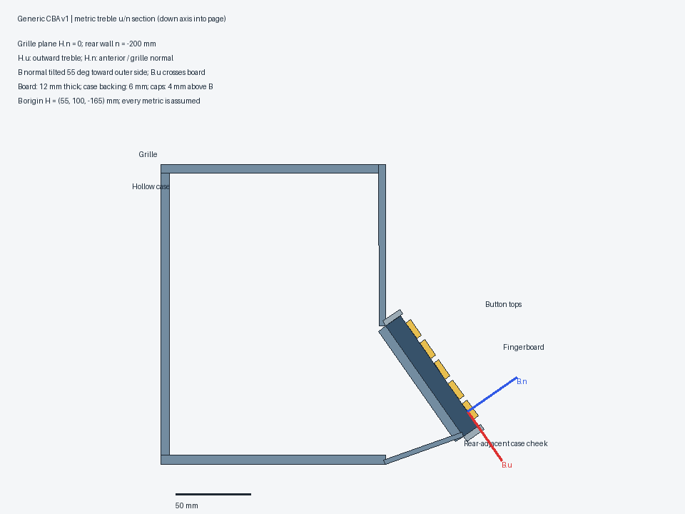
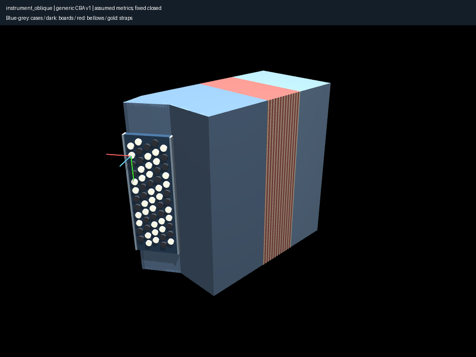
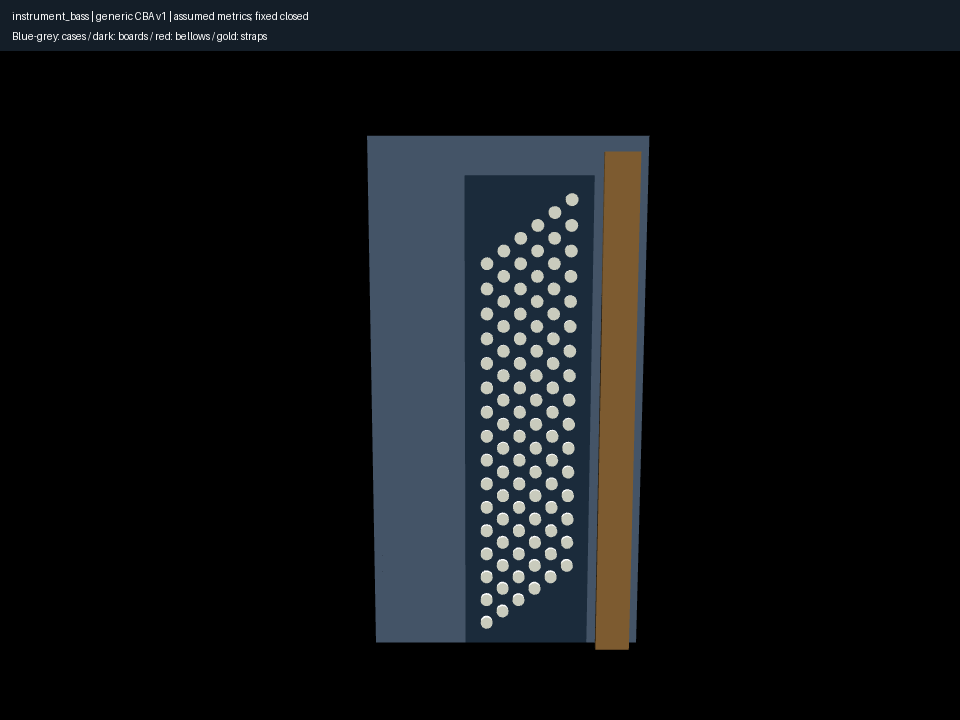
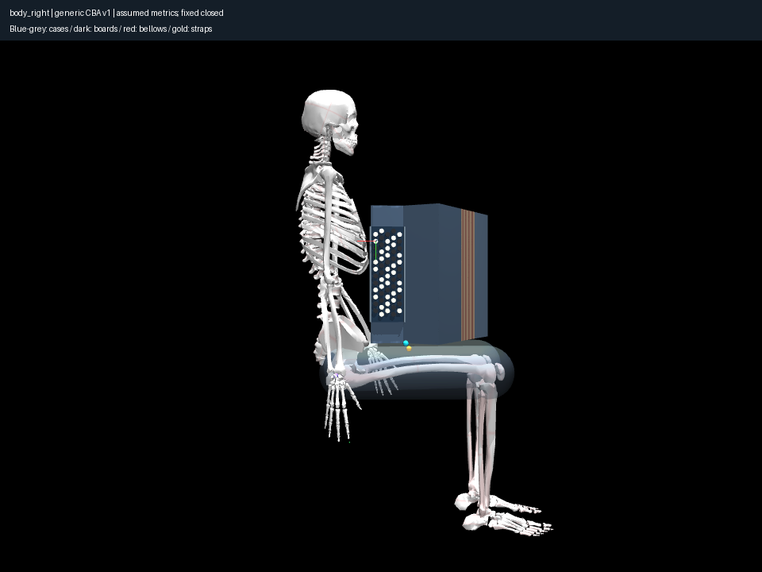

# Ground the closed CBA before contact research

The validated reference is `reference/`, using explicit `generic_cba_v1` and the
unchanged reduced MyoFullBody anatomy. Research and all chosen metrics are in
[generic-cba.md](../../docs/research/generic-cba.md).

The owner caught a wrong attachment in the first draft: a plate/block near the
front grille corner. Further end-on official Roland views and primary Hohner
construction descriptions distinguish the conventional rear-adjacent case cheek
from deliberate forward-keyboard designs. The corrected B origin is H=(55,100,
−165) mm, not (55,65,−50) mm. A full-height angled backing, front shoulder and rear
return carry the board; it is no longer attached to an exposed front block.
The precise 55° angle and offsets are still assumptions, not photo measurements.
[Rejected draft](rejected-front-attachment/notes.md) remains frozen separately;
its numerical successes do not validate its physical geometry.

The physical cases, 62-button treble board, 96-button slanted bass board, closed
bellows and strap landmarks have independent frames. Hollow wall components
replace the oversized solid collision box. No anatomical scaling, collision
weakening, moving bellows or left-hand playing was introduced. Small convex
MuJoCo-native end-closure prisms close the case extension; no CAD dependency.

All 158 contact targets/normals are numerically checked; maximum treble frame
residual is **3.10e−17 m**. Minimum cap-to-nonparent component distance is **5.5 mm**.
Every overlapping case component pair is reported. The maximum **7.62 mm** is
at the rear-return/backing seam; all overlaps are within enumerated structural
joins, not the usable button region. Caps meet their parent boards at their bases.
Component walls, panels, caps and bellows retain the old instrument/anatomy mask
compatibility; bellows ribs and hand-strap illustration are visual-only.

A compiled-axis test caught an intermediate cross-section calculation that
accidentally retained the B origin's vertical component when defining two walls.
Rendered wall axes visibly skewed. Explicitly removing that component gives
walls parallel to H.v; the compiled-axis test prevents recurrence. This was a
transient construction bug, not a contact result.

Approximate native thigh-support capsules were previously discarded with the
upstream world decoration. The new geometry branch retains those named proxies
for independent distances; the historical branch is untouched for exact replay.
The reference case has **11.389/10.000 mm** right/left approximate thigh clearance
and **14.641 mm** minimum anatomical-proxy/component distance in the neutral arm
state. Torso support remains conservative and cases visibly stand forward of
rib bones; these are assumed envelopes, not fitted chest/skin or load equilibrium.
The passive left arm remains below/behind the bass board, not fitted to it.

Inspected six instrument views, the metric section and five mounted views. The
section is coordinate-derived; the top render independently shows compiled case
shape. All **12 images reproduce byte-for-byte** from saved qpos/cameras in this
EGL/Mesa environment. Rendering preserves complete MJB identity. Independent
bass-relative rigid transformations move its case, board, caps and strap sites
while every treble body and RH target remains invariant. Nonzero bellows opening
is rejected; hypothetical test transforms are not physical movement assumptions.

97 tests, Ruff and ty pass. New and rejected frozen roots verify completely
(integrity only). Historical
profile/MJB tests remain unchanged. Use current source for `reference`; reproduce
rejected drafts with their own source snapshots. A current-source rejected-draft
replay must fail strict MJB validation. Experiment 033 supplies freshly solved
playing states, sampled paths, multistart sensitivity and independent hand-proxy
coverage. No complete anatomical feasibility is claimed.
